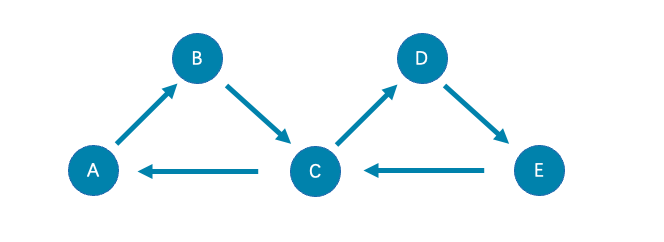

# 路径

图论中一个非常重要的概念是路径，路径是指一个有限或无限的边序列，这些边连接着一系列点。

路径的类型分为三种：`walk`、`trail`、`path`。关于路径的详细说明，请参见[维基百科](https://en.wikipedia.org/wiki/Path_(graph_theory)#Walk,_trail,_path)。

本文以下图为例进行简单介绍。

## walk

`walk`类型的路径由有限或无限的边序列构成。遍历时点和边可以重复。

查看示例图，由于C、D、E构成了一个环，因此该图包含无限个路径，例如`A->B->C->D->E`、`A->B->C->D->E->C`、`A->B->C->D->E->C->D`。

!!! note

    原生nGQL的`GO`语句采用的是`walk`类型路径。

## trail

`trail`类型的路径由有限的边序列构成。遍历时只有点可以重复，边不可以重复。柯尼斯堡七桥问题的路径类型就是`trail`。

查看示例图，由于边不可以重复，所以该图包含有限个路径，最长路径由5条边组成：`A->B->C->D->E->C`。

!!! note

    openCypher兼容语句的`MATCH`语句采用的是`trail`类型路径。

在trail类型中，还有 `cycle` 和 `circuit` 两种特殊的路径类型，使用以下图为例对这两种特殊的数据类型介绍。

- cycle

   `cycle` 是封闭的 `trail` 类型的路径，遍历时边不可以重复，起点和终点重复，并且没有其他顶点重复。在此示例图中，最长路径由三条边组成：`A->B->C->A`或`C->D->E->C`.

- circuit

   `circuit` 也是封闭的 `trail` 类型的路径，遍历时边不可以重复，除起点和终点重复外，可能存在其他顶点重复。在此示例图中，最长路径为：`A->B->C->D->E->C->A`。

## path

`path`类型的路径由有限的边序列构成。遍历时点和边都不可以重复。

查看示例图，由于点和边都不可以重复，所以该图包含有限个路径，最长路径由4条边组成：`A->B->C->D->E`。
