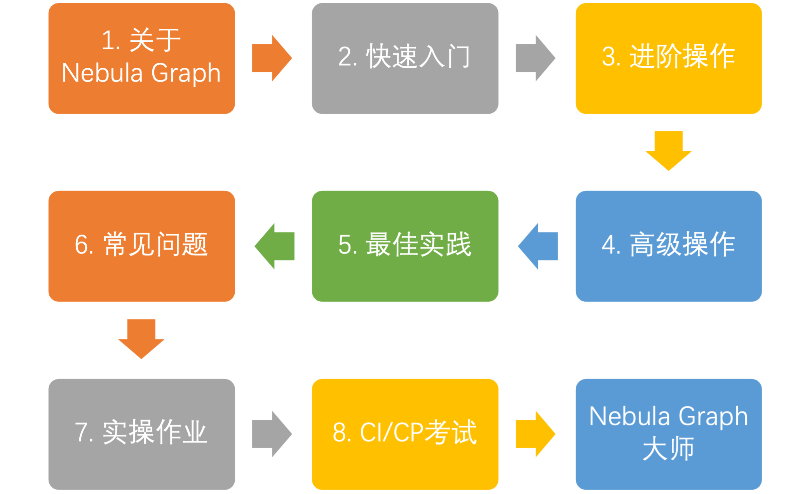

# Nebula Graph 学习路径

本文介绍 Nebula Graph 学习路径，让用户由浅入深玩转图数据库 Nebula Graph。

 

 ## 1. 关于 Nebula Graph

 ### 1.1 什么是 Nebula Graph？

| [文档](https://docs.nebula-graph.com.cn/{{nebula.release}}/1.introduction/1.what-is-nebula-graph/) | [视频](https://www.bilibili.com/video/BV1kf4y1v7LM) |
| ------------------------------------------------------------ | --------------------------------------------------- |

 ### 1.2 基本概念

  - 图相关术语

    | [视频](https://www.bilibili.com/video/BV17X4y1A7p9) |
    | --------------------------------------------------- |

  - 数据模型
  
    | [文档](https://docs.nebula-graph.com.cn/{{nebula.release}}/1.introduction/2.data-model/) |
    | ------------------------------------------------------------ |

  - 路径
  
    | [文档](https://docs.nebula-graph.com.cn/{{nebula.release}}/1.introduction/1.what-is-nebula-graph/) | [视频](https://www.bilibili.com/video/BV1kf4y1v7LM) |
    | ------------------------------------------------------------ | --------------------------------------------------- |

  - 产品架构

    | 文档                                                         | 视频                                                         |
    | ------------------------------------------------------------ | ------------------------------------------------------------ |
    | [Meta 服务](https://docs.nebula-graph.com.cn/{{nebula.release}}/1.introduction/3.nebula-graph-architecture/2.meta-service/) | -                                                            |
    | [Graph 服务](https://docs.nebula-graph.com.cn/{{nebula.release}}/1.introduction/3.nebula-graph-architecture/3.graph-service/) | [Nebula Graph Query Engine](https://www.bilibili.com/video/BV1xV411n7DD) |
    | [Storage服务](https://docs.nebula-graph.com.cn/nebula.release/1.introduction/3.nebula-graph-architecture/4.storage-service/) | [Nebula Graph Storage](https://www.bilibili.com/video/BV16b4y1Q77k) |

 ## 2. 快速入门

 ### 2.1 安装 Nebula Graph

  - 使用 RPM/DEB 包
  
    | [文档](https://docs.nebula-graph.com.cn/master/4.deployment-and-installation/2.compile-and-install-nebula-graph/2.install-nebula-graph-by-rpm-or-deb/) |
    | ------------------------------------------------------------ |

  - 使用 TAR 包
  
    | [文档](https://docs.nebula-graph.com.cn/master/4.deployment-and-installation/2.compile-and-install-nebula-graph/4.install-nebula-graph-from-tar/) |
    | ------------------------------------------------------------ |

  - 使用 Docker

    | [文档](https://docs.nebula-graph.com.cn/master/4.deployment-and-installation/2.compile-and-install-nebula-graph/3.deploy-nebula-graph-with-docker-compose/) | [视频](https://www.bilibili.com/video/BV1T54y1b7pa) |
    | ------------------------------------------------------------ | --------------------------------------------------- |

  - 使用源码

    | [文档](https://docs.nebula-graph.com.cn/master/4.deployment-and-installation/2.compile-and-install-nebula-graph/1.install-nebula-graph-by-compiling-the-source-code/) |
    | ------------------------------------------------------------ |

 ### 2.2 启动 Nebula Graph

  | [文档](https://docs.nebula-graph.com.cn/master/2.quick-start/5.start-stop-service/) |
  | ------------------------------------------------------------ |

 ### 2.3 连接 Nebula Graph

  | [文档](https://docs.nebula-graph.com.cn/master/2.quick-start/3.connect-to-nebula-graph/) |
  | ------------------------------------------------------------ |

 ### 2.4 使用 nGQL 命令

  | [文档](https://docs.nebula-graph.com.cn/master/2.quick-start/6.cheatsheet-for-ngql-command/) |
  | ------------------------------------------------------------ |

 ## 3. 进阶操作

 ### 3.1 部署多机集群

  | [文档](https://docs.nebula-graph.com.cn/master/4.deployment-and-installation/2.compile-and-install-nebula-graph/deploy-nebula-graph-cluster/) |
  | ------------------------------------------------------------ |

 ### 3.2 升级集群版本

  | 文档                                                         |
  | ------------------------------------------------------------ |
  | [升级 v2.0.x 至当前版本](https://docs.nebula-graph.com.cn/master/4.deployment-and-installation/3.upgrade-nebula-graph/upgrade-nebula-from-200-to-latest/) |
  | [升级 v2.0.0-GA 以下版本至当前版本](https://docs.nebula-graph.com.cn/master/4.deployment-and-installation/3.upgrade-nebula-graph/upgrade-nebula-graph-to-latest/) |

 ### 3.3 配置Nebula

  | 文档                                                         |
  | ------------------------------------------------------------ |
  | [配置 Meta](https://docs.nebula-graph.com.cn/master/5.configurations-and-logs/1.configurations/2.meta-config/) |
  | [配置 Graph](https://docs.nebula-graph.com.cn/master/5.configurations-and-logs/1.configurations/3.graph-config/) |
  | [配置 Storage](https://docs.nebula-graph.com.cn/master/5.configurations-and-logs/1.configurations/4.storage-config/) |
  | [配置 Linux 内核](https://docs.nebula-graph.com.cn/master/5.configurations-and-logs/1.configurations/6.kernel-config/) |

 ### 3.4 配置日志

| [文档](https://docs.nebula-graph.com.cn/master/5.configurations-and-logs/2.log-management/logs/) |
| ------------------------------------------------------------ |

 ### 3.5 运维与管理

  - 账号鉴权和授权

    | 文档                                                         |
    | ------------------------------------------------------------ |
    | [本地身份验证](https://docs.nebula-graph.com.cn/master/7.data-security/1.authentication/1.authentication/#_2) |
    | [OpenLDAP](https://docs.nebula-graph.com.cn/master/7.data-security/1.authentication/4.ldap/) |
    | [管理用户](https://docs.nebula-graph.com.cn/master/7.data-security/1.authentication/2.management-user/) |
    | [内置角色](https://docs.nebula-graph.com.cn/master/7.data-security/1.authentication/3.role-list/) |

  - 平衡分片分布

    | [文档](https://docs.nebula-graph.com.cn/master/8.service-tuning/load-balance/) |
    | ------------------------------------------------------------ |

  - 监控
  
    | 文档                                                         |
    | ------------------------------------------------------------ |
    | [Nebula 指标](https://docs.nebula-graph.com.cn/master/6.monitor-and-metrics/1.query-performance-metrics/) |
    | [RocksDB 统计数据](https://docs.nebula-graph.com.cn/master/6.monitor-and-metrics/2.rocksdb-statistics/) |

  - 数据快照

    | [文档](https://docs.nebula-graph.com.cn/master/7.data-security/3.manage-snapshot/) |
    | ------------------------------------------------------------ |

  - 资源隔离

    | [文档](https://docs.nebula-graph.com.cn/master/7.data-security/5.zone/) |
    | ------------------------------------------------------------ |

  - SSL 加密

    | [文档](https://docs.nebula-graph.com.cn/master/7.data-security/4.ssl/) |
    | ------------------------------------------------------------ |

 ### 3.6 性能调优
 ### 3.7 周边工具

 ## 4. 高阶操作

 ## 5. 最佳实践

 ## 6. 常见问题

 ## 7. 实操作业

 ## 8. 通过 CI/CP 考试