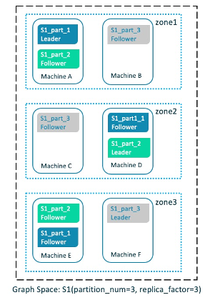

# Zone

Nebula Graph 提供 Zone 功能，可以将 Storage 节点进行分组管理，实现资源隔离。

## 背景信息

!!! compatibility

    从 3.0 版本开始，在配置文件中添加的 Storage 节点无法直接使用，仅将节点信息存储在 Meta 服务中，需要使用`ADD HOST <ip>:<port>`命令将节点加入集群，才能正常使用。每个 Storage 节点加入集群时，会默认加入名称格式为`default_zone_<host>_<port>`的 Zone 中。

用户可以将 Storage 节点加入某个 Zone 中，创建图空间时指定 Zone，就会在 Zone 内的 Storage 节点上创建及存储图空间。分片及其副本会均匀存储在各个 Zone 中。如下图所示。



6 台启动 Storage 服务的机器两两组合，加入 3 个 Zone。指定这三个 Zone 创建图空间 S1，分片及其副本会均匀存储在 Zone1~Zone3。

## 适用场景

- 期望将图空间创建在某些指定的 Storage 节点上，从而达到资源隔离的目的。

- 集群滚动升级。需要停止一个或多个服务器并更新，然后重新投入使用，直到集群中所有的节点都更新为新版本。

## 注意事项

- Zone 是 Storage 节点的集合，每个 Storage 节点只能加入一个 Zone。

- 创建 Space 时需要指定 Zone 列表，该图空间的副本将均匀分布在各个 Zone 中。同一个分片在一个 Zone 中只能有一个副本，因此副本数量不能超过指定 Zone 数量。

- 多个 Zone 可以合并，合并时将检查所有图空间分片的分布情况，防止同一个分片的不同副本分布在同一个 Zone 中。

- 一个 Zone 可以拆分为多个 Zone。

## 基本语法

### ADD HOST


### MERGE ZONE

创建 Zone，并将 Storage 节点加入 Zone。

```ngql
ADD ZONE <zone_name> <host1>:<port1> [,<host2>:<port2>...];
```

示例：

```ngql
nebula> ADD ZONE zone1 192.168.8.111:9779, 192.168.8.129:9779;
```

### ADD HOST...INTO ZONE

将单个 Storage 节点加入已创建的 Zone。

!!! note

    加入之后请使用 [BALANCE](../3.ngql-guide/18.operation-and-maintenance-statements/2.balance-syntax.md) 命令实现负载均衡。

```ngql
ADD HOST <host1>:<port1> INTO ZONE <zone_name>;
```

### DROP HOST...FROM ZONE

从 Zone 中删除单个 Storage 节点。

!!! note

    Group 中正在使用的 Storage 节点无法直接删除，需要先删除关联的图空间，才能删除 Storage 节点。

```ngql
DROP HOST <host1>:<port1> FROM ZONE <zone_name>;
```

### SHOW ZONES

查看所有 Zone。

```ngql
SHOW ZONES;
```

### DESCRIBE ZONE

查看指定 Zone。

```ngql
DESCRIBE ZONE <zone_name>;
DESC ZONE <zone_name>;
```

### DROP ZONE

删除 Zone。

!!! note

    已加入 Group 的 Zone 无法直接删除，需要先从 Group 中剔除该 Zone，或删除所属的 Group 后，才能删除 Zone。

```ngql
DROP ZONE <zone_name>;
```

### ADD GROUP

创建 Group，并将 Zone 加入 Group。

```ngql
ADD GROUP <group_name> <zone_name> [,<zone_name>...];
```

示例：

```ngql
nebula> ADD GROUP group1 zone1,zone2;
```

### ADD ZONE...INTO GROUP

将单个 Zone 加入已创建的 Group。

!!! note

    加入之后请使用 [BALANCE](../3.ngql-guide/18.operation-and-maintenance-statements/2.balance-syntax.md) 命令实现负载均衡。

```ngql
ADD ZONE <zone_name> INTO GROUP <group_name>;
```

### DROP ZONE...FROM GROUP

从 GROUP 中删除单个 Zone。

!!! note

    Group 中正在使用的 Zone 无法直接删除，需要先删除关联的图空间，才能删除 Zone。

```ngql
DROP ZONE <zone_name> FROM GROUP <group_name>;
```

### SHOW GROUPS

查看所有 Group。

```ngql
SHOW GROUPS;
```

### DESCRIBE GROUP

查看指定 Group。

```ngql
DESCRIBE GROUP <group_name>;
DESC GROUP <group_name>;
```

### DROP GROUP

删除 Group。

!!! note

    正在使用的 Group 无法直接删除，需要先删除关联的图空间，才能删除 Group。

```ngql
DROP GROUP <group_name>;
```
