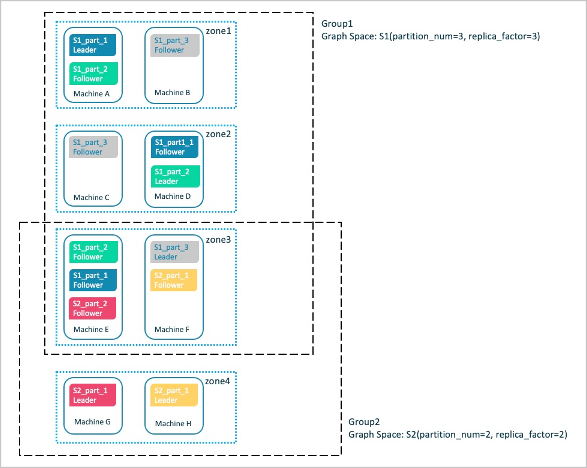

# Group&Zone

Nebula Graph提供Group&Zone功能，可以将Storage节点进行分组管理，实现资源隔离。

## 背景信息

随着Nebula性能与稳定性不断增强，在生产系统中占据的比重越来越大，很多重要数据存储在Nebula Graph中，为了实现资源隔离，提高数据安全性，Nebula Graph提供Group&Zone功能。

用户可以将Storage节点加入某个Zone中，多个Zone构成一个Group。创建图空间时指定Group，就会在Group内的Storage节点上创建及存储图空间。分片及其副本会均匀存储在各个Zone中。如下图所示。



8台启动Storage服务的机器两两组合，加入4个Zone。然后将Zone1、Zone2、Zone3加入Group1，Zone3、Zone4加入Group2。

指定Group1创建图空间S1，分片及其副本会均匀存储在Zone1~Zone3，不会存储到Zone4的机器上。

指定Group2创建图空间S2，分片及其副本会均匀存储在Zone3~Zone4。不会存储到Zone1和Zone2的机器上。

上述例子简单介绍了Zone功能，用户可以通过合理规划Zone和Group，实现资源隔离。

## 适用场景

- 期望将图空间创建在某些指定的Storage节点上，从而达到资源隔离的目的。

- 集群滚动升级。需要停止一个或多个服务器并更新，然后重新投入使用，直到集群中所有的节点都更新为新版本。

## 注意事项

- Zone是Storage节点的集合，每个Storage节点只能加入一个Zone。

- Zone中可以存储分片的副本，但同一个分片在一个Zone中只能有一个副本。

- 多个Zone可以组成一个Group，方便管理，并且可以进行资源隔离。

- 一个Zone可以加入多个Group。

- 创建Space时如果指定Group，该图空间的副本将均匀分布在该Group的各个Zone中。

- 一个Group可以创建多个图空间，但是Group中Zone的数量需要大于等于创建图空间时指定的副本数（`replica_factor`）。

## 基本语法

### ADD ZONE

创建Zone，并将Storage节点加入Zone。

```ngql
ADD ZONE <zone_name> <host1>:<port1> [,<host2>:<port2>...];
```

示例：

```ngql
nebula> ADD ZONE zone1 192.168.8.111:9779, 192.168.8.129:9779;
```

### ADD HOST...INTO ZONE

将单个Storage节点加入已创建的Zone。

```ngql
ADD HOST <host1>:<port1> INTO ZONE <zone_name>;
```

### DROP HOST...FROM ZONE

从Zone中删除单个Storage节点。

```ngql
DROP HOST <host1>:<port1> FROM ZONE <zone_name>;
```

### SHOW ZONES

查看所有Zone。

```ngql
SHOW ZONES;
```

### DESCRIBE ZONE

查看指定Zone。

```ngql
DESCRIBE ZONE <zone_name>;
DESC ZONE <zone_name>;
```

### DROP ZONE

删除Zone。

!!! note

    已加入Group的Zone无法直接删除，需要先从Group中剔除该Zone，或删除所属的Group后，才能删除Zone。

```ngql
DROP ZONE <zone_name>;
```

### ADD GROUP

创建Group，并将Zone加入Group。

```ngql
ADD GROUP <group_name> <zone_name> [,<zone_name>...];
```

示例：

```ngql
nebula> ADD GROUP group1 zone1,zone2;
```

### ADD ZONE...INTO GROUP

将单个Zone加入已创建的Group。

```ngql
ADD ZONE <zone_name> INTO GROUP <group_name>;
```

### DROP ZONE...FROM GROUP

从GROUP中删除单个Zone。

```ngql
DROP ZONE <zone_name> FROM GROUP <group_name>;
```

### SHOW GROUPS

查看所有Group。

```ngql
SHOW GROUPS;
```

### DESCRIBE GROUP

查看指定Group。

```ngql
DESCRIBE GROUP <group_name>;
DESC GROUP <group_name>;
```

### DROP GROUP

删除GROUP。

```ngql
DROP GROUP <group_name>;
```

