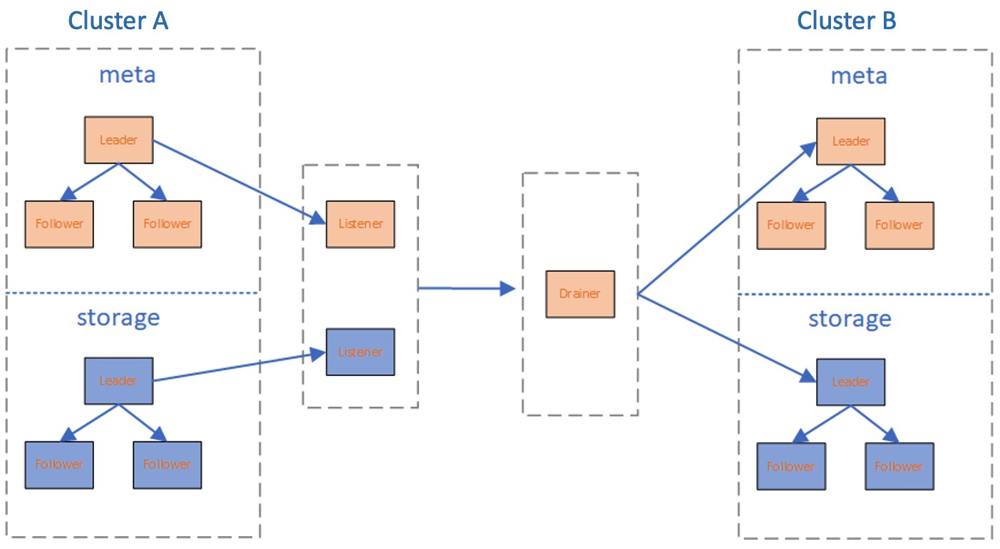

# 集群间数据异步复制

Nebula Graph 支持在集群间进行数据的异步复制，即主集群 A 的数据可以异步复制到从集群 B 中，方便用户进行异地灾备，降低数据丢失的风险，保证数据安全。

!!! enterpriseonly

    仅企业版支持本功能。

## 背景



在集群间数据异步复制方案中，主集群 A 和从集群 B 有各自的 Meta 服务和 Storage 服务，任何向主集群 A 中指定图空间写入的数据，都会将 WAL 发送到 Meta listener 或 Storage listener。listener 再将 WAL 发送到 drainer。drainer 接收存储 WAL 并返回下一次需要的 WAL，然后将 WAL 里的 KV 数据通过 Meta client 或 Storage client 发送至从集群。

通过以上流程，最终实现集群间数据异步复制（近实时的数据同步）。

## 适用场景

- 异地灾备：通过异步复制可以实现跨机房或者跨城市的异地灾备。

- 数据迁移：通过切换主从集群的身份，可以实现业务不停机或大幅减少停机时间。

- 读写分离：通过设置主集群只写，从集群只读，实现读写分离，降低集群负载，提高稳定性和可用性。

## 操作步骤

本文操作步骤示例是一个单向的异步复制，在实际生产环境中，建议配置双向的异步复制（只是不能两个方向同时生效），方便切换主从集群。如需设置双向的异步复制，请多搭建 1 个 listener 和 drainer 服务。

### 准备工作

- 准备至少 2 台部署服务的机器。主从集群需要分开部署，listener 和 drainer 可以单独部署，也可以分别部署在主从集群所在机器上，但是会增加集群负载。

- 准备企业版 License 文件。

### 示例环境

主集群A：机器IP地址为`192.168.10.101`，只启动 Graph、Meta、Storage 服务。

从集群B：机器IP地址为`192.168.10.102`，只启动 Graph、Meta、Storage 服务。

listener：机器IP地址为`192.168.10.103`，只启动 Meta-listener、Storage-listener 服务。

drainer：机器IP地址为`192.168.10.104`，只启动 drainer 服务。

### 1.搭建主从集群、listener 和 drainer 服务

1. 在所有机器上安装 Nebula Graph，修改配置文件：

  - 主、从集群修改：`nebula-graphd.conf`、`nebula-metad.conf`、`nebula-storaged.conf`。

  - listener 修改：`nebula-metad-listener.conf`、`nebula-storaged-listener.conf`。

  - drainer 修改：`nebula-drainerd.conf`

  修改配置文件的一些重点内容如下：
  
  - 所有配置文件里都需要用真实的机器 IP 地址替换`local_ip`的`127.0.0.1`。

  - 所有`nebula-graphd.conf`配置文件里设置`enable_authorize=true`

  - 主从集群填写各自的`meta_server_addrs`。

  - listener 的配置文件里`meta_server_addrs`填写主集群的机器 IP，`meta_sync_listener`填写 listener 机器的 IP。

  - drainer 的配置文件里`meta_server_addrs`填写从集群的机器 IP。

  更多配置说明，请参见[配置管理](../5.configurations-and-logs/1.configurations/1.configurations.md)。

2. 在所有机器的 Nebula Graph 安装目录内启动对应的服务：

  - 主、从集群启动命令：`sudo scripts/nebula.service start all`。

  - listener 启动命令：

    - Meta listener：`sudo bin/nebula-metad --flagfile etc/nebula-metad-listener.conf`

    - Storage listener：`sudo bin/nebula-storaged --flagfile etc/nebula-storaged-listener.conf`

  - drainer 启动命令：`sudo scripts/nebula-drainerd.service start`

3. 登录主集群增加 Storage 主机，检查 listener 服务状态。

  ```
  nebula> ADD HOSTS 192.168.10.101:9779;
  nebula> SHOW HOSTS STORAGE;
  +------------------+------+----------+-----------+--------------+----------------------+
  | Host             | Port | Status   | Role      | Git Info Sha | Version              |
  +------------------+------+----------+-----------+--------------+----------------------+
  | "192.168.10.101" | 9779 | "ONLINE" | "STORAGE" | "xxxxxxx"    | "ent-3.1.0"          |
  +------------------+------+----------+-----------+--------------+----------------------+

  nebula> SHOW HOSTS STORAGE LISTENER;
  +------------------+------+----------+--------------------+--------------+----------------------+
  | Host             | Port | Status   | Role               | Git Info Sha | Version              |
  +------------------+------+----------+--------------------+--------------+----------------------+
  | "192.168.10.103" | 9789 | "ONLINE" | "STORAGE_LISTENER" | "xxxxxxx"    | "ent-3.1.0"          |
  +------------------+------+----------+--------------------+--------------+----------------------+

  nebula> SHOW HOSTS META LISTENER;
  +------------------+------+----------+-----------------+--------------+----------------------+
  | Host             | Port | Status   | Role            | Git Info Sha | Version              |
  +------------------+------+----------+-----------------+--------------+----------------------+
  | "192.168.10.103" | 9559 | "ONLINE" | "META_LISTENER" | "xxxxxxx"    |  "ent-3.1.0"         |
  +------------------+------+----------+-----------------+--------------+----------------------+
  ```

4. 登录从集群增加 Storage 主机，检查 drainer 服务状态。  

  ```
  nebula> ADD HOSTS 192.168.10.102:9779;
  nebula> SHOW HOSTS STORAGE;
  +------------------+------+----------+-----------+--------------+----------------------+
  | Host             | Port | Status   | Role      | Git Info Sha | Version              |
  +------------------+------+----------+-----------+--------------+----------------------+
  | "192.168.10.102" | 9779 | "ONLINE" | "STORAGE" | "xxxxxxx"    | "ent-3.1.0"          |
  +------------------+------+----------+-----------+--------------+----------------------+

  nebula> SHOW HOSTS DRAINER;
  +------------------+------+----------+-----------+--------------+----------------------+
  | Host             | Port | Status   | Role      | Git Info Sha | Version              |
  +------------------+------+----------+-----------+--------------+----------------------+
  | "192.168.10.104" | 9889 | "ONLINE" | "DRAINER" | "xxxxxxx"    | "ent-3.1.0"          |
  +------------------+------+----------+-----------+--------------+----------------------+
  ```

### 2.设置服务

1. 登录主集群，创建图空间`basketballplayer`。

  ```
  nebula> CREATE SPACE basketballplayer(partition_num=15, replica_factor=1, vid_type=fixed_string(30));
  ```

2. 进入图空间`basketballplayer`，注册 drainer 服务。

  ```
  nebula> USE basketballplayer;
  //注册 drainer 服务。
  nebula> SIGN IN DRAINER SERVICE(192.168.10.104:9889);
  //检查是否注册成功。
  nebula> SHOW DRAINER CLIENTS;
  +-----------+------------------+------+
  | Type      | Host             | Port |
  +-----------+------------------+------+
  | "DRAINER" | "192.168.10.104" | 9889 |
  +-----------+------------------+------+
  ```

3. 设置 listener 服务。

  ```
  //设置 listener 服务。
  nebula> ADD LISTENER SYNC META 192.168.10.103:9559 STORAGE 192.168.10.103:9789 TO SPACE replication_basketballplayer;
  //查看 listener 状态。
  nebula> SHOW LISTENER SYNC;
  +--------+--------+------------------------+--------------------------------+----------+
  | PartId | Type   | Host                   | SpaceName                      | Status   |
  +--------+--------+------------------------+--------------------------------+----------+
  | 0      | "SYNC" | ""192.168.10.103":9559" | "replication_basketballplayer" | "ONLINE" |
  | 1      | "SYNC" | ""192.168.10.103":9789" | "replication_basketballplayer" | "ONLINE" |
  | 2      | "SYNC" | ""192.168.10.103":9789" | "replication_basketballplayer" | "ONLINE" |
  | 3      | "SYNC" | ""192.168.10.103":9789" | "replication_basketballplayer" | "ONLINE" |
  | 4      | "SYNC" | ""192.168.10.103":9789" | "replication_basketballplayer" | "ONLINE" |
  | 5      | "SYNC" | ""192.168.10.103":9789" | "replication_basketballplayer" | "ONLINE" |
  | 6      | "SYNC" | ""192.168.10.103":9789" | "replication_basketballplayer" | "ONLINE" |
  | 7      | "SYNC" | ""192.168.10.103":9789" | "replication_basketballplayer" | "ONLINE" |
  | 8      | "SYNC" | ""192.168.10.103":9789" | "replication_basketballplayer" | "ONLINE" |
  | 9      | "SYNC" | ""192.168.10.103":9789" | "replication_basketballplayer" | "ONLINE" |
  | 10     | "SYNC" | ""192.168.10.103":9789" | "replication_basketballplayer" | "ONLINE" |
  | 11     | "SYNC" | ""192.168.10.103":9789" | "replication_basketballplayer" | "ONLINE" |
  | 12     | "SYNC" | ""192.168.10.103":9789" | "replication_basketballplayer" | "ONLINE" |
  | 13     | "SYNC" | ""192.168.10.103":9789" | "replication_basketballplayer" | "ONLINE" |
  | 14     | "SYNC" | ""192.168.10.103":9789" | "replication_basketballplayer" | "ONLINE" |
  | 15     | "SYNC" | ""192.168.10.103":9789" | "replication_basketballplayer" | "ONLINE" |
  +--------+--------+------------------------+--------------------------------+----------+
  ```

4. 登录从集群，创建图空间`replication_basketballplayer`。

  ```
  nebula> CREATE SPACE replication_basketballplayer(partition_num=15, replica_factor=1, vid_type=fixed_string(30));
  ```

5. 进入图空间`replication_basketballplayer`，设置 drainer 服务。

  ```
  //设置 drainer 服务。
  nebula> ADD DRAINER 192.168.10.104:9889;
  //查看 drainer 状态。
  nebula> SHOW DRAINERS;
  +-------------------------+----------+
  | Host                    | Status   |
  +-------------------------+----------+
  | ""192.168.10.104":9889" | "ONLINE" |
  +-------------------------+----------+
  ```

6. 修改图空间为只读。

  !!! note

        修改为只读是防止误操作导致数据不一致。只影响该图空间，其他图空间仍然可以读写。

  ```
  nebula> USE replication_basketballplayer;
  //设置当前图空间为只读。
  nebula> SET VARIABLES read_only=true;
  //查看当前图空间的读写属性。
  nebula> GET VARIABLES read_only;
  +-------------+--------+-------+
  | name        | type   | value |
  +-------------+--------+-------+
  | "read_only" | "bool" | true  |
  +-------------+--------+-------+
  ```

### 3.验证数据

1. 登录主集群，创建 Schema，插入数据。

  ```
  nebula> USE basketballplayer;
  nebula> CREATE TAG player(name string, age int);
  nebula> CREATE EDGE follow(degree int);
  nebula> INSERT VERTEX player(name, age) VALUES "player100":("Tim Duncan", 42);
  nebula> INSERT VERTEX player(name, age) VALUES "player101":("Tony Parker", 36);
  nebula> INSERT EDGE follow(degree) VALUES "player101" -> "player100":(95);
  ```

2. 登录从集群，检查数据。

  ```
  nebula> USE replication_basketballplayer;
  nebula> SUBMIT JOB STATS;
  nebula> SHOW STATS;
  +---------+------------+-------+
  | Type    | Name       | Count |
  +---------+------------+-------+
  | "Tag"   | "player"   | 2     |
  | "Edge"  | "follow"   | 1     |
  | "Space" | "vertices" | 2     |
  | "Space" | "edges"    | 1     |
  +---------+------------+-------+

  nebula> FETCH PROP ON player "player100" YIELD properties(vertex);
  +-------------------------------+
  | properties(VERTEX)            |
  +-------------------------------+
  | {age: 42, name: "Tim Duncan"} |
  +-------------------------------+

  nebula> GO FROM "player101" OVER follow YIELD dst(edge);
  +-------------+
  | dst(EDGE)   |
  +-------------+
  | "player100" |
  +-------------+
  ```

## 切换主从集群

如果因为业务需要进行数据迁移，或者灾备恢复后需要切换主从集群，需要手动进行切换。

!!! note

  在切换主从之前需要配置双向的主从复制，即主从集群有各自的 listener 和 drainer，但是同一时间只能一个方向生效。

1. 登录主集群，取消 drainer 和 listener 服务。

  ```
  nebula> USE basketballplayer;
  nebula> SIGN OUT DRAINER SERVICE;
  nebula> REMOVE LISTENER SYNC;
  ```

2. 设置图空间为只读，防止有新的数据写入主集群，导致数据不一致。

  ```
  nebula> SET VARIABLES read_only=true;
  ```

3. 登录从集群，设置图空间为可读写，取消 drainer。

  ```
  nebula> USE replication_basketballplayer;
  nebula> SET VARIABLES read_only=false;
  nebula> REMOVE DRAINER;
  ```

4. 将从集群更改为主集群。

  ```
  nebula> SIGN IN DRAINER SERVICE(192.168.10.104:9889);
  nebula> ADD LISTENER SYNC META 192.168.10.103:9559 STORAGE 192.168.10.103:9789 TO SPACE basketballplayer;
  nebula> REMOVE DRAINER;
  ```

5. 登录之前的主集群，将其更改为从集群。

  ```
  nebula> USE basketballplayer;
  //修改图空间为可读写，否则无法设置 drainer 服务。
  nebula> SET VARIABLES read_only=false;
  nebula> ADD DRAINER 192.168.10.104:9889;
  nebula> SET VARIABLES read_only=true;
  ```
