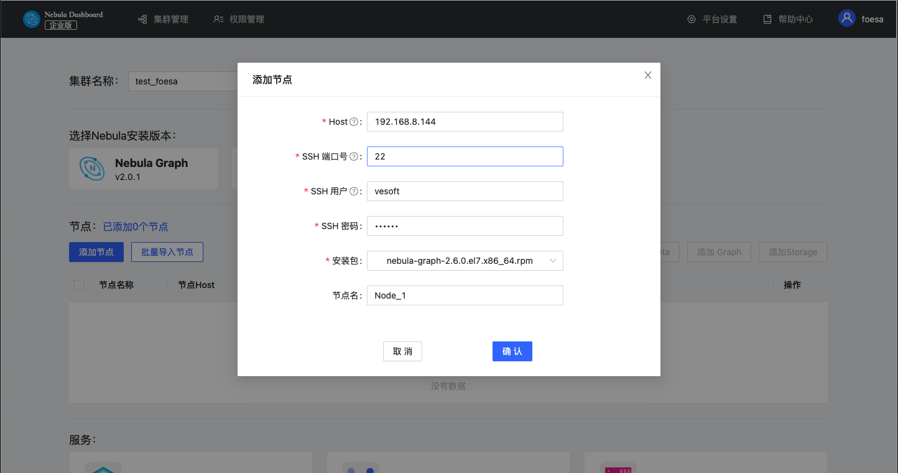
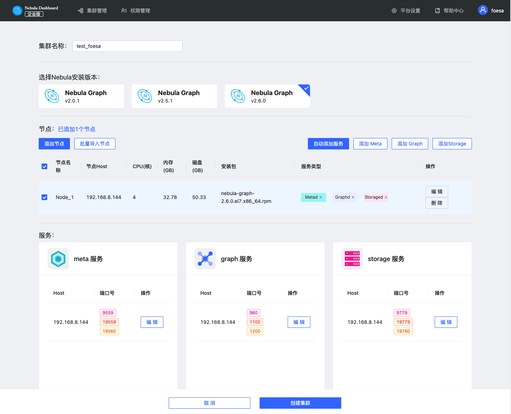
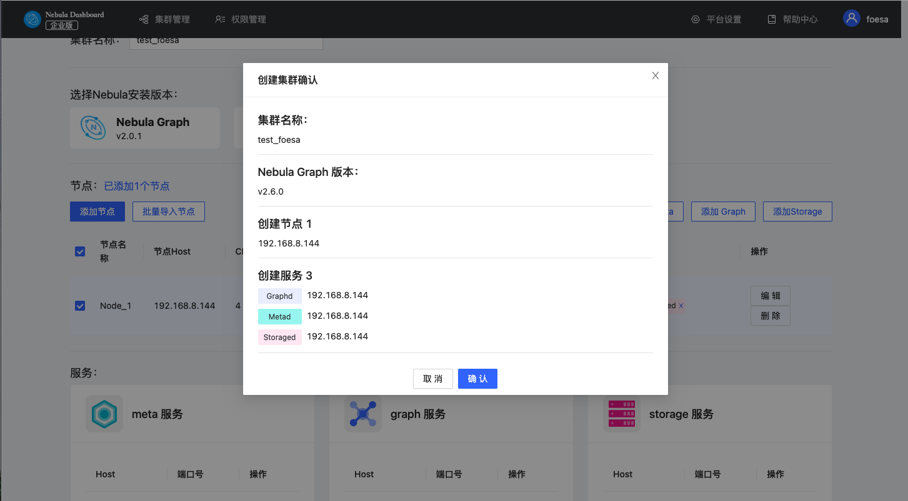

# 创建集群

本文介绍如何通过 Dashboard 创建集群。

## 操作步骤

按以下方式创建集群

1. 在集群列表页面，点击 **创建集群** 标签。
2. 在创建集群页面，完成以下配置：
   - 输入 **集群名称**，最大可输入15个字符，本示例设置为`test_foesa`。
   - 选择 Nebula Graph 安装版本，本示例设置为 `v2.6.0`。
   - 添加节点或者批量导入节点。
  
     1. 配置每个节点的 Host 信息，本示例设置为 `192.168.8.144`。
     2. 配置 SSH 信息，本示例设置如下：SSH 端口号为`22`，SSH 用户名为 `vesoft`，SSH 密码为`nebula`。
     3. 选择 Nebula Graph 安装包，本示例为`nebula-graph-2.6.0.el7.x86_64rpm`。
     4. （可选）输入节点名。本示例设置为`Noed_1`。

     

3. 勾选节点并添加服务。创建集群需要给节点添加3种类型的服务，如果不熟悉 Nebula Graph 架构，建议勾选节点点击 **自动添加服务** 按钮。

4. （可选）在下方的服务中，选择编辑 meta、graph、storage 服务的端口号、HTTP端口号、HTTP2端口号，点击确认保存。

   

5. 点击**创建集群**，确定配置信息无误且节点无冲突后，点击**确认**。

   

6. 在集群管理页面中的列表中出现状态为`installing`的集群，状态变为`healthy`即集群创建成功。
   

## 后续操作

成功创建集群后，用户可以对集群进行操作，详情见[总览](../4.cluster-operator/1.overview.md)。