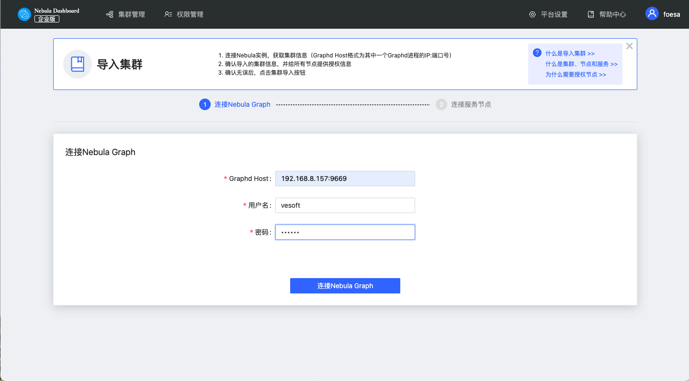
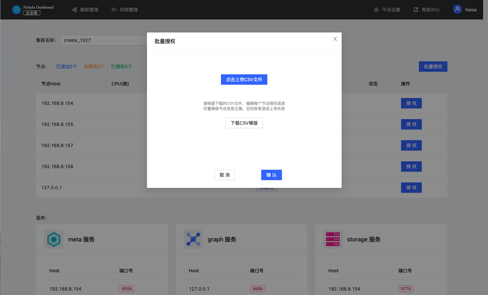
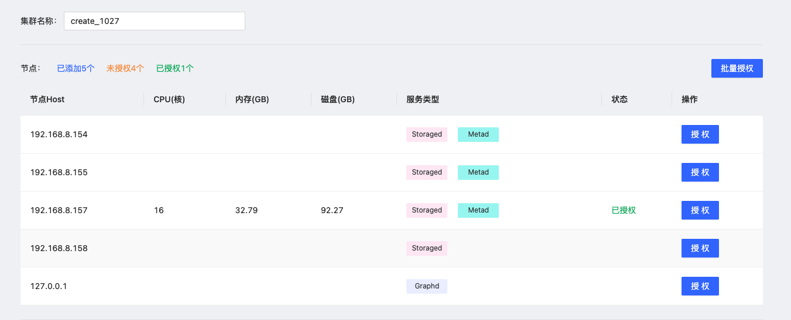

# 导入集群

本文介绍如何通过Dashboard导入集群，暂不支持导入使用Docker和Kubernetes方式部署的集群。

## 操作步骤

1. 在集群列表页面，点击 **导入集群** 标签。
2. 在导入集群页面输入 **Graphd Host**，本示例设置为 `192.168.8.157:9669`。
3. 输入 **用户名** 及 **密码**，本示例设置为`vesoft`和`nebula`。

   

4. 在连接服务节点页面完成以下配置：
   - 输入集群的名称，最大可输入15个字符，本示例设置为`create_1027`。
   
   - 对节点进行 **授权** 或 **批量授权** 。授权需输入每个节点的 SSH 用户名及密码；批量授权需要上传CSV文件。请根据下载的CSV文件，编辑每个节点授权信息，尽量确保节点信息正确，否则容易造成上传失败。页面中节点状变为 **已授权**，则该节点授权成功。
   

5. 确保所有节点都授权成功，点击 **导入集群**。

## 后续操作

成功导入集群后，用户可以对集群进行操作，详情见[总览](../4.cluster-operator/1.overview.md)。