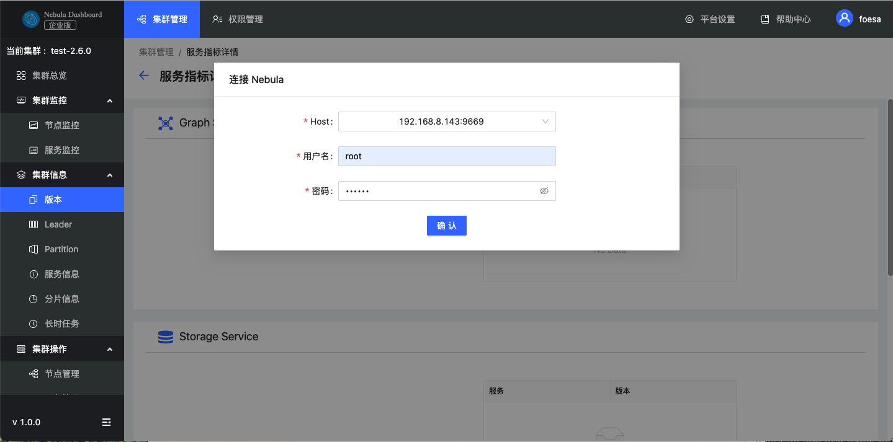

# 集群信息

本文主要介绍 Dashboard 的集群信息，主要为以下六个部分：
- 版本
- Leader
- Partition
- 服务信息
- 分片信息
- 长时任务

在查看集群信息之前，用户需要选择Host信息，输入用户名及密码以连接Nebula。

因为 Nebula Graph 默认不启用身份验证，所以，一般情况下用户可以使用 `root` 账号和任意密码连接 Nebula。

当 Nebula Graph 启用了身份验证后，用户只能使用指定的账号和密码连接 Nebula。关于 Nebula Graph 的身份验证功能，参考 [Nebula Graph 用户手册](../../7.data-security/1.authentication/1.authentication.md "点击前往 Nebula Graph 官网")。

## 版本

在该目录下，可以查看所有服务及对应的版本。

## Leader

在该目录下，可以查看 Leader 数量及 Leader 的分布，点击右上角的 **Balance Leader** 按钮可以快速在 Nebula Graph 集群中均衡分布 Leader。

## Partition

在该目录下，选择指定图空间，查看指定图空间的 Partition 分布情况。

## 服务信息

在该目录下，展示Storage服务的基本信息，包括主机信息、版本Commit ID、leader总数、分片分布和leader分布，参数说明如下：

| 参数 | 说明 |
| :--- | :--- |
| `Host` | 主机地址 |
| `Port` | 主机端口号 |
| `Status` | 主机状态 |
| `Git Info Sha` | 版本Commit ID |
| `Leader Count` | Leader总数 |
| `Partition Distribution` | 分片分布 |
| `Leader Distribution` | Leader分布 |

## 分片信息

可以选择不同图空间，查看分片信息。用户可以通过右上角的输入框，输入分片ID，筛选展示的数据。参数说明如下：

|参数|说明|
|:---|:---|
|`Partition ID`|分片序号。|
|`Leader`|分片的leader副本的IP地址和端口。|
|`Peers`|分片所有副本的IP地址和端口。|
|`Losts`|分片的故障副本的IP地址和端口。|

## 长时任务

展示所有作业的信息。暂不支持在线管理作业，详情请参见[作业管理](../../3.ngql-guide/18.operation-and-maintenance-statements/4.job-statements.md)。参数说明如下：

| 参数 | 说明 |
| :--- | :--- |
| `Job ID` |  |
| `Command` ||
| `Status` | 显示作业或任务的状态。 |
|`Start Time`|显示作业或任务开始执行的时间。|
| `Stop Time` | 显示作业或任务结束执行的时间，结束后的状态包括`FINISHED`、`FAILED`或`STOPPED`。 |