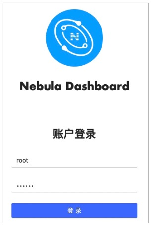
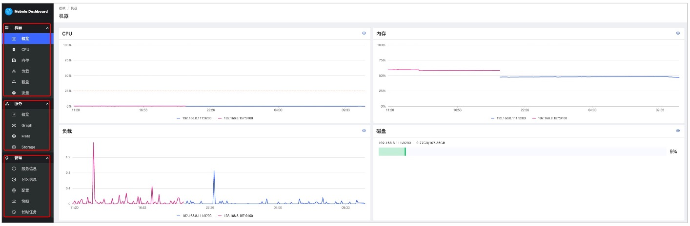

# 使用Dashboard

Dashboard部署完成后，可以通过浏览器登录使用Dashboard。

## 登录Dashboard

确认`nebula-graph-dashboard`服务所在机器的IP地址，在浏览器中输入`<IP>:7003`打开登录页面，输入Nebula Graph数据库的账号和密码，单击登录。

## 页面概览

Dashboard页面主要分为机器、服务、管理三个部分，如下图。

## 机器页面介绍

机器页面分为如下几个子页面：

- 概览
  
  可以查看最近一天的CPU、内存、负载、磁盘和上下行流量变化情况。

  如果需要查看某一项更详细的监控指标，可以单击模块右上角的眼睛标志，或者在左侧单击监控项。

- CPU、内存、负载、磁盘、流量
  
  分类展示机器各个维度的详细监控数据。
  
  - 页面的左上角，可以选择最多14天的监控数据进行查看，也可以快捷选择1小时、6小时、12小时、1天、3天、7天和14天。

  - 页面的右上角，可以选择需要查看的机器和监控指标。监控指标详情请参见[监控指标说明](6.monitor-parameter.md)。

## 服务页面介绍

服务页面分为如下几个子页面：

- 概览

  可以查看最近一天各种服务的监控指标变化情况，右上角还可以切换到**版本**页面查看所有服务的IP地址和版本。
  
  如果需要查看某一种服务更详细的监控指标，可以单击模块右上角的眼睛标志，或者在左侧单击具体服务。

  !!! note

        当前社区版的概览页仅支持每种服务设置两个监控指标，可以单击模块内的**设置**按钮进行调整。

- Graph、Meta、Storage

  分类展示各个服务的详细监控数据。

  - 页面的左上角，可以选择最多14天的监控数据进行查看，也可以快捷选择1小时、6小时、12小时、1天、3天、7天和14天。

  - 页面的左上角，可以选择需要查看监控数据的机器、监控指标、聚合方式和周期。监控指标详情请参见[监控指标说明](6.monitor-parameter.md)。

  - 页面的右上角，可以查看当前服务的状态。

## 管理页面介绍

管理页面分为如下几个子页面：

- 服务信息

  展示Storage服务的基本信息，包括机器信息、leader总数、分片分布和leader分布。

- 分片信息

  可以选择不同图空间，查看分片信息。参数说明如下。

  |参数|说明|
  |:---|:---|
  |`Partition ID`|分片序号。|
  |`Leader`|分片的leader的IP地址和端口。|
  |`Peers`|分片所有副本的IP地址和端口。|
  |`Losts`|分片的故障离线副本的的IP地址和端口。|

- 配置
  
  展示各个服务的配置信息。暂不支持在线修改配置，详情请参见[配置管理](../5.configurations-and-logs/1.configurations/1.configurations.md)。

- 长时任务

  展示所有作业的信息。暂不支持在线管理作业，详情请参见[作业管理](../3.ngql-guide/18.operation-and-maintenance-statements/4.job-statements.md)。