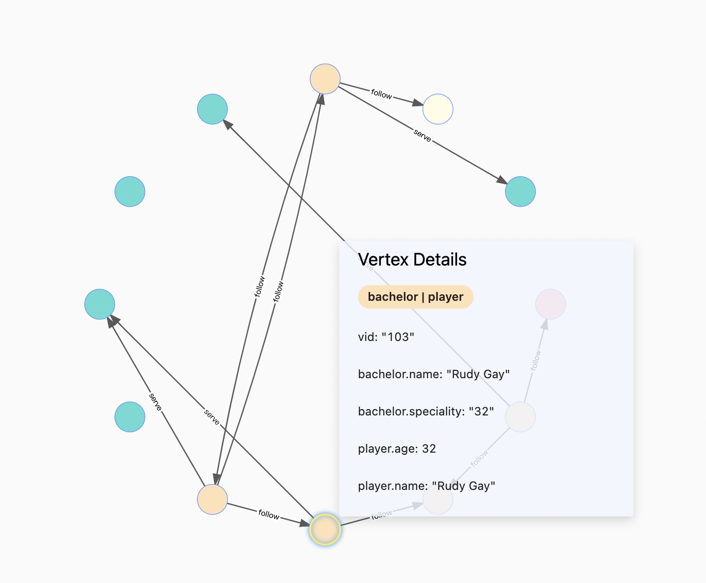
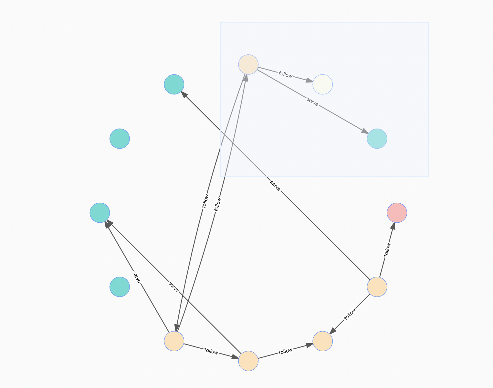
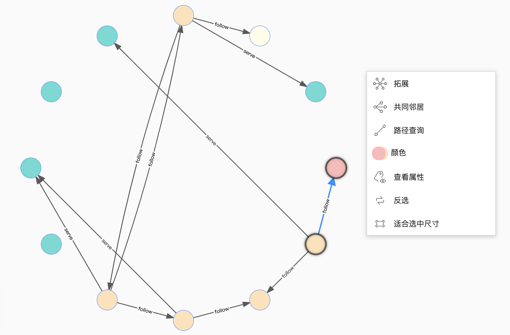

# 画布操作

本文主要介绍画布中的操作。

## 查看点边

用户可以移动鼠标到点和边上，详细查看点和边的数据。以下展示 VID 为 `103` 的点的详细信息：

## 选中操作

用户可以按住左键拖拽框选多个点和边，或是按住 **Shift** 选中多个点和边，对选中的点和边进行操作。

## 快速操作

用户可以选择一个或多个点和边，在空白处点击右键可以进行对点进行扩展、查找两个点之间的路径、查看属性等等的操作。如果用户只选中一个点，不能查找共同邻居和路径查询。如果用户只选中一条边，只能查看这条边的属性。

点击适合选中尺寸可以将选中的数据，移动到画布的中心，方便用户查看。

