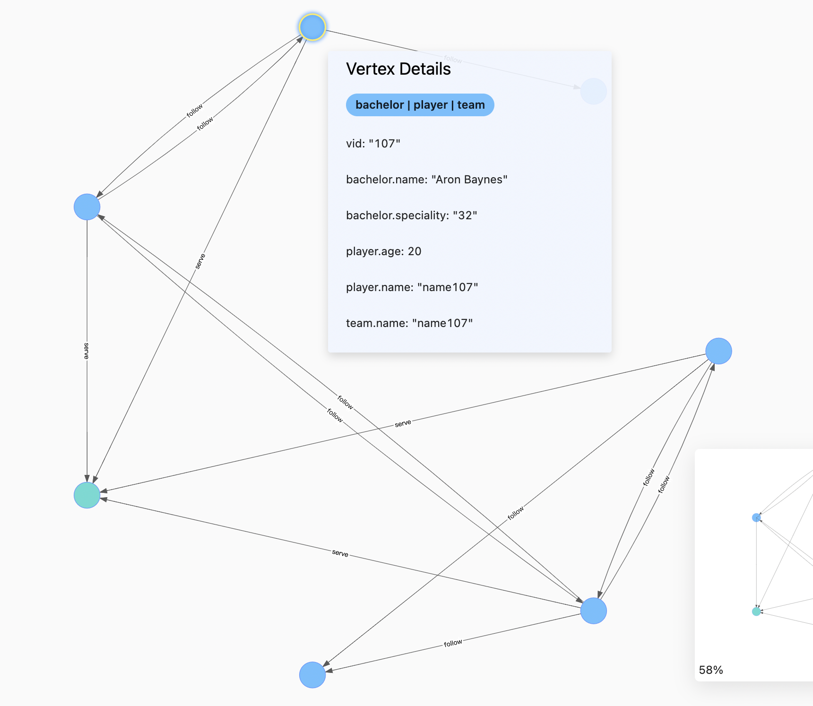
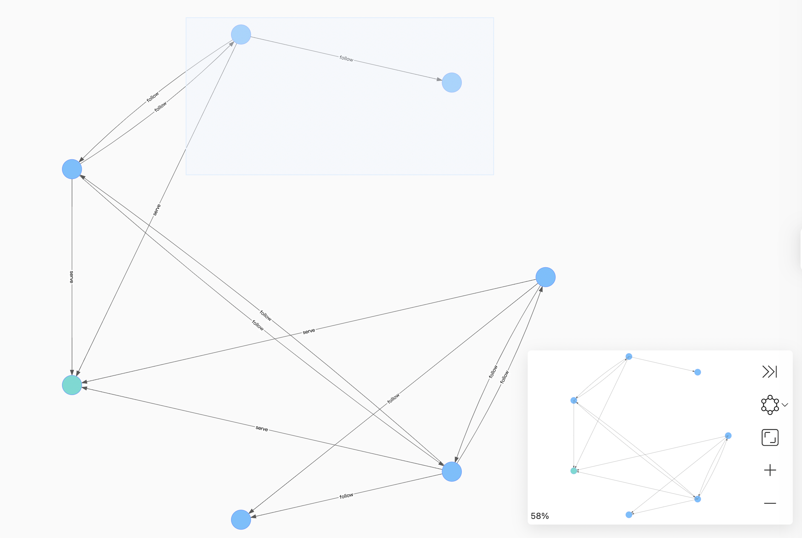
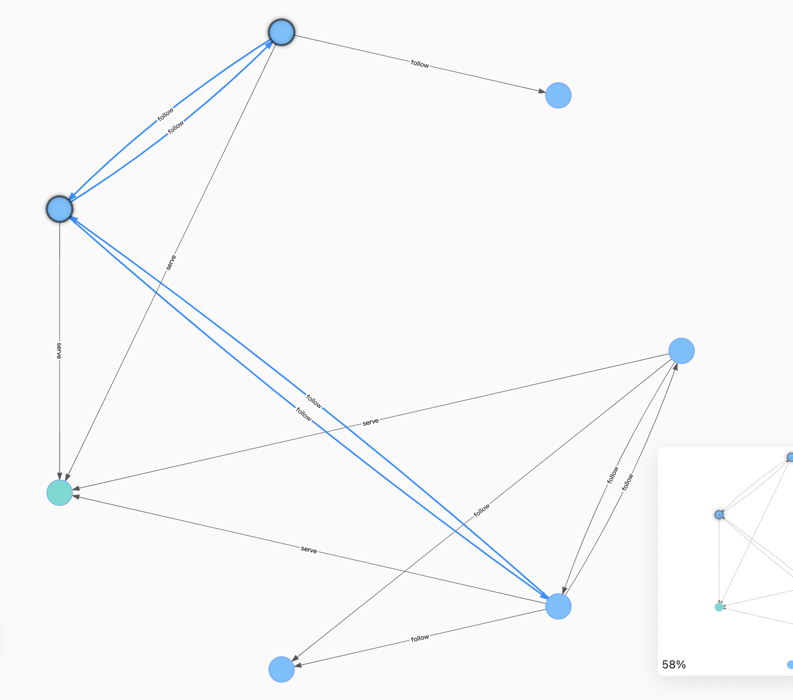
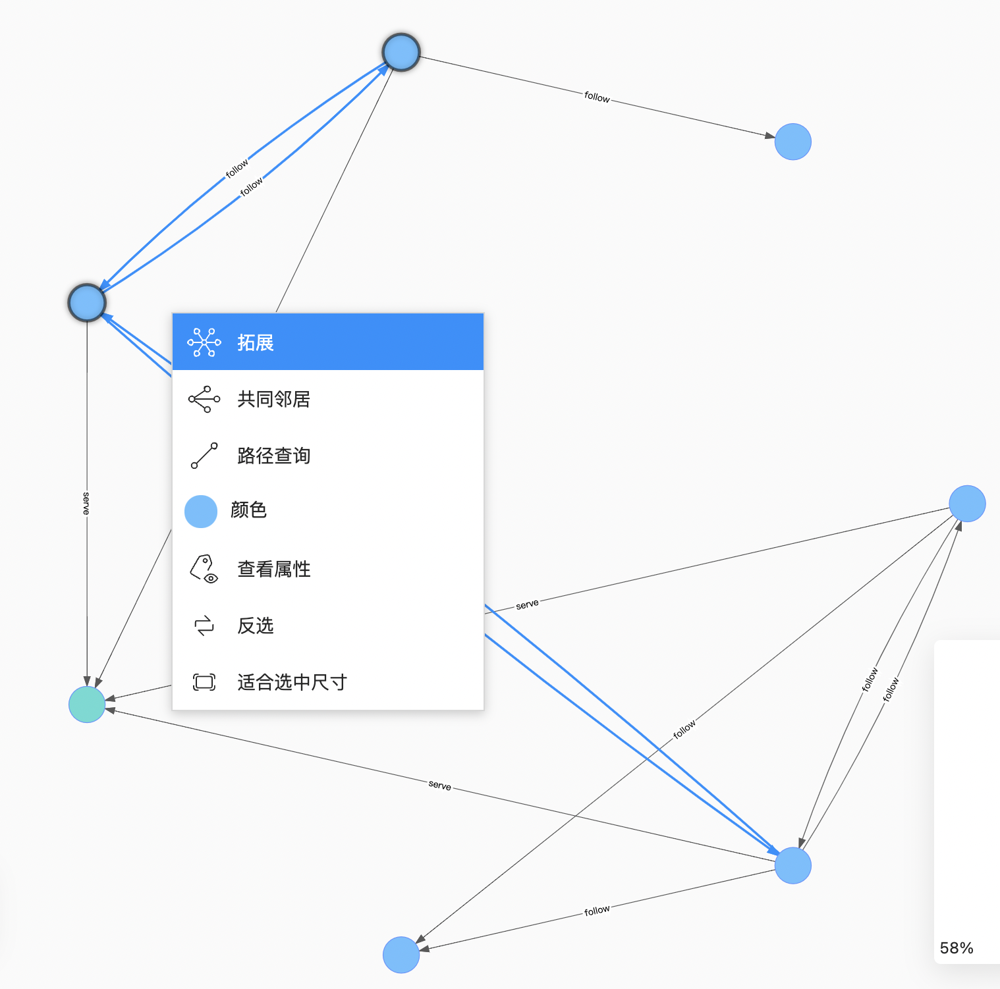

# 画布操作

本文主要介绍画布中的操作。

## 查看点边

移动鼠标到点或边上，详细查看点和边的数据。以下展示 VID 为 `107` 的点的详细信息：

## 批量选中

### 框选操作

点击 图标后，按住左键拖拽并框选多个点和边。示例如下：

### 点击选择多个节边

点击 图标后，点击画布中的多个点和边，单击空白处取消选择。示例如下：

### 快捷键操作

按住 Shift 之后用鼠标单击并选中多个点和边。

## 快速操作

用户可以选择一个或多个点和边，在空白处点击右键可以进行对点进行扩展、查找两个点之间的路径、在页面中显示或隐藏其属性等等的操作。用户选择的点和边数据会影响到可以执行的操作，具体操作的说明参见[图探索拓展](../operation-guide/ex-ug-garph-exploration.md)。

点击适合选中尺寸可以将选中的数据，移动到画布的中心，方便用户查看。
