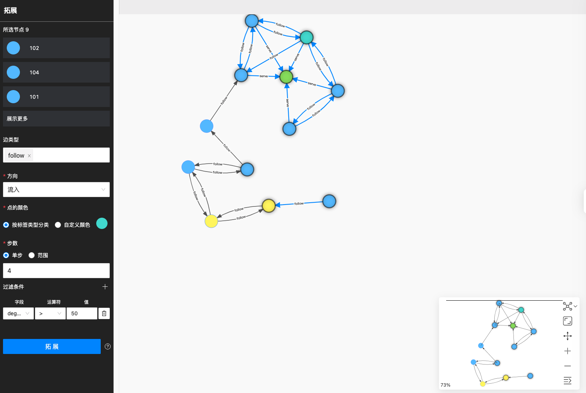
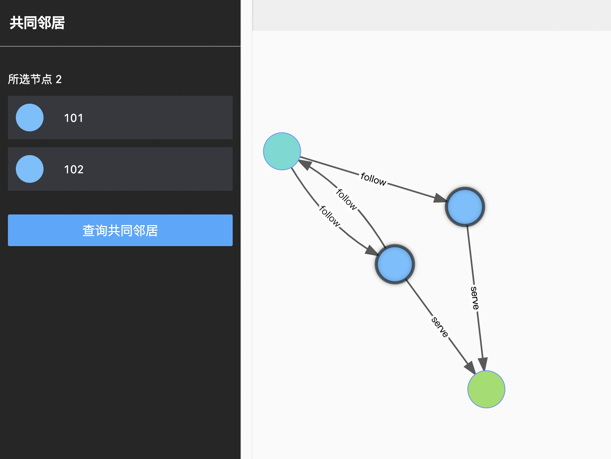
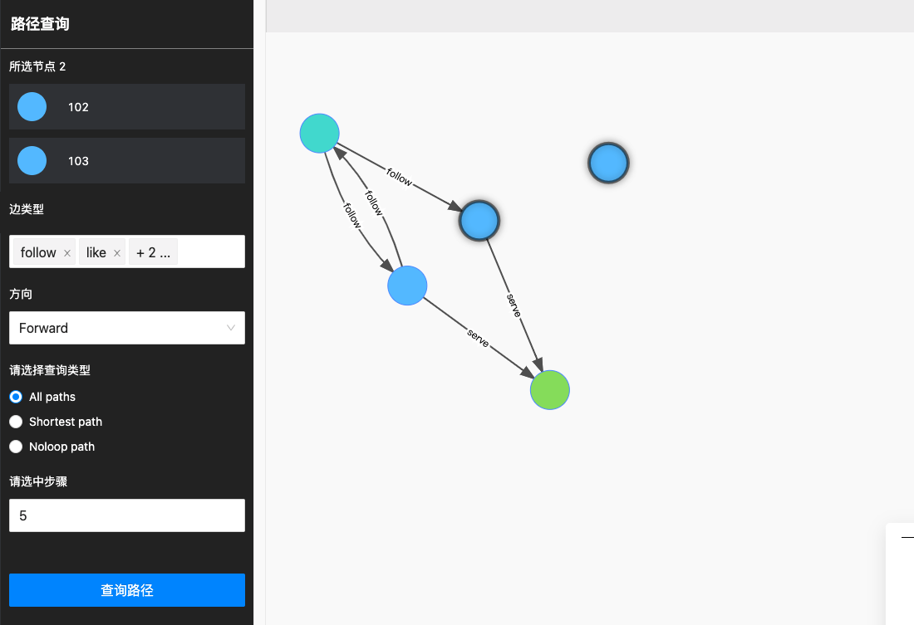
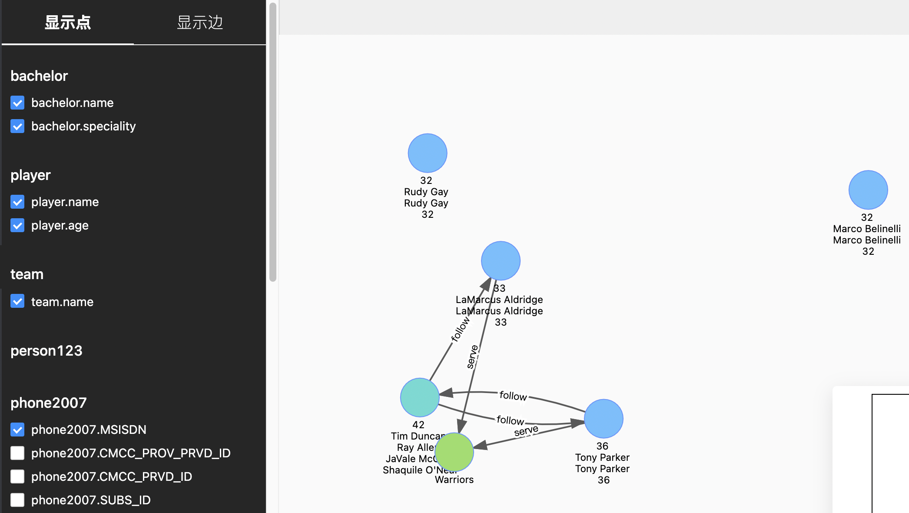

# 图探索拓展

图探索拓展分为以下四类：

- 拓展
- 共同邻居
- 路径查询
- 查看属性

## 拓展

用户可以双击某一点，对该点进行拓展。也可以框选画布中的多个点，在如下操作栏中修改边类型，选择边的流入流出方向，修改点的颜色，规定拓展步数和自定义过滤条件。

## 共同邻居

用户可以选中画布中的两个点，查询两点的共同邻居。选中多个点并查询共同邻居时，默认返回 **没有相应数据** 。

## 路径查询

用户可以选中画布中的两个点，默认框选的第一个点为起点，第二个点为终点。用户可自定义边的类型和方向，规定拓展步数，选择查询以下三种路径： `All path`，`Shortest path` 和 `Noloop path`。

## 查看属性

用户可以在选择画布中展示或隐藏，点的属性或边的属性。

