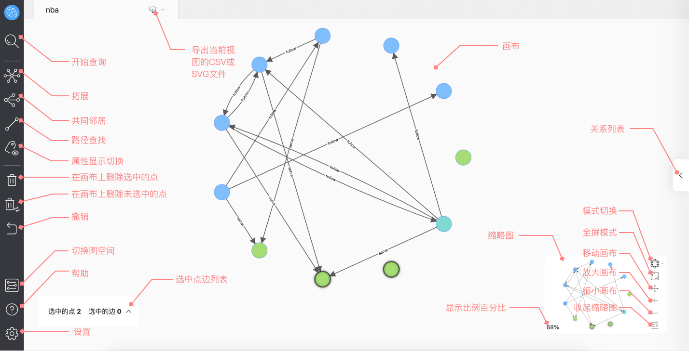

# 页面概览

本文主要介绍 Explorer 的主页面。

## 概览

Explorer 的主页面分为五个部分：

- 标签栏
- 侧边栏
- 画布
- 缩略图
- 关系列表

## 标签栏

- 导出图形：支持导出当前视图的 CSV 文件或图片（SVG）文件。

## 侧边栏

侧边栏包括四个部分，用户可以点击按钮对图进行探索、修改画布上点的内容等等。

- 查询探索：在进行探索之前，用户需要在查询数据并显示在画布中。

- 图探索拓展：包括对点的拓展、查找两个点的共同邻居、查找两个点的路径、显示属性切换等功能。

- 删除及撤销：对画布中显示的数据删除、撤回上一步操作。

- 设置和帮助：切换图空间、查找帮助、修改设置等。

### 查询探索

- 开始：单击 图标，通过VID、Tag和子图，查询数据并显示到页面上。

### 图探索扩展

- 拓展：单击 图标，选择页面上的节点并进行自定义拓展，包括拓展方向、拓展步数、过滤条件等。
- 共同邻居：单击 图标，选择页面上 2 个点并查看它们的共同邻居。
- 路径查询：单击 图标，可以查询起点到终点之间的 `all paths` 、 `Shortest path` 或者是 `Noloop path` 的路径。
- 查看属性：单击 图标，选择是否显示画板中的点或边的属性值。

### 删除及撤销

- 删除：单击 图标，可以删除画板中选中的点。
- 反向删除：单击 图标，可以删除画布中未选择的所有点。
- 撤销：单击 图标，撤销上一步操作。

### 设置及帮助

- 选择图空间：单击 图标，切换当前图空间。
- 帮助：单击 图标，查看更多信息。
- 设置：单击 图标，可以查看用户名和快捷键、修改语言设置、清除 Explorer 链接等。
## 画布

画布主要分为：

- 图：显示通过VID、Tag或子图查询的数据。

- 点边概览：默认隐藏，在当前画布选中点和边时才显示。点击（）图标，用户可以打开菜单，查看当前子图中选中的点和边的详细数据。

## 缩略图

用户可以通过缩略图上的按钮，完成图模式的切换，全屏展示画布中的图，移动、放大、缩小画布，收起缩略图等。同时在缩略图的左下角显示了画布中的图占总图的百分比。

- 图模式切换：用户可以切换画布中图的展示模式。

| 图标 |force | dagre | circular | 
| ---- | ---- |----| ----|
| 展示模式 | force（力导向图） | dagre（层次图） | circular（环形图） |
## 关系列表

点击右侧的 图标，用户可以打开菜单，查看画板中 Tag 和 Edge 的数量、搜索 Tag 和 Edge ，同时也支持修改 Tag 的颜色和 Icon 。