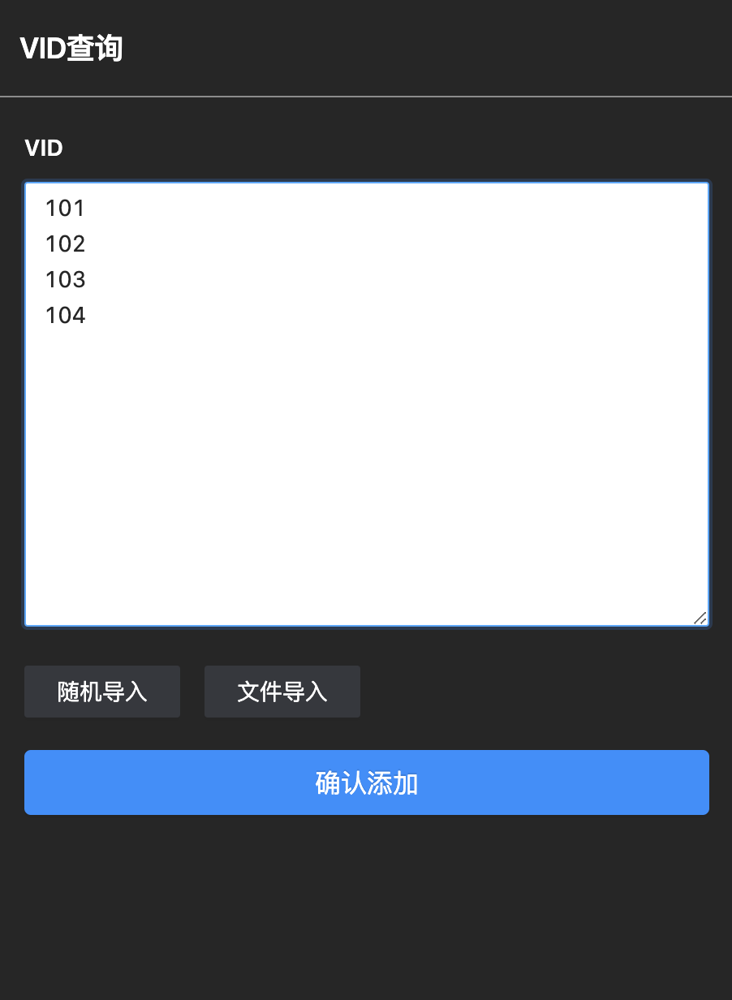
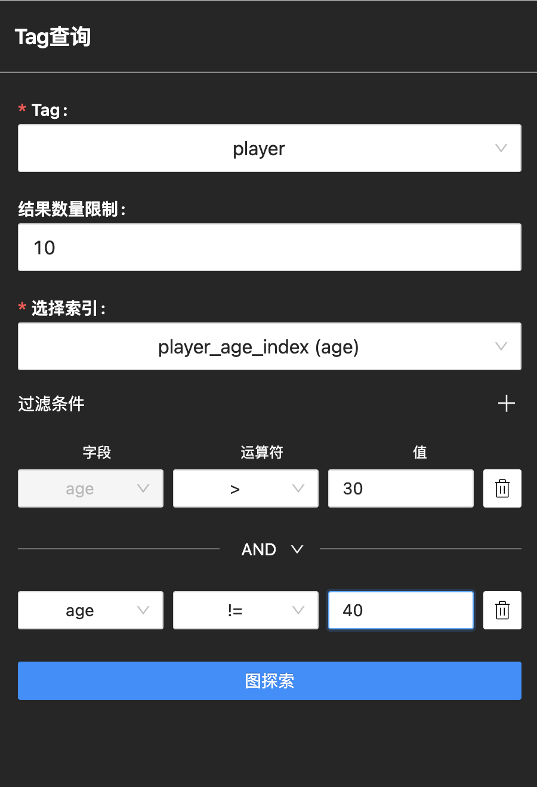
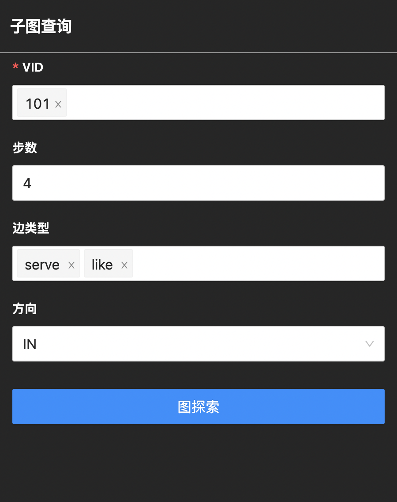

# 查询探索

在 Explorer 中，用户可以选择以下查询方式，展示数据：

- VID 查询
- Tag 查询
- 子图查询

## VID 查询

用户可以通过输入VID或者生成VID的数据查询，一行仅支持一个数据。同时也支持随机导入数据和文件导入数据。确认添加后，数据会显示在画布中。以下给出示例：

## Tag 查询

基于 Tag 查询，必选值为 Tag 和索引。用户可以对输出的结果进行数量上的限制和结果进行过滤。以下查询 10 个年龄大于 30 岁，且不等于 40 岁的球员，示例如下：

## 子图查询

基于子图查询，必选值为 VID 。用户可以查看一个或多个点的子图，支持规定子图的步数、边类型及流入流出的方向。以下给出 VID 值为 101 ，步数为 4 ，边类型为 server 和 like 的入边的示例：
