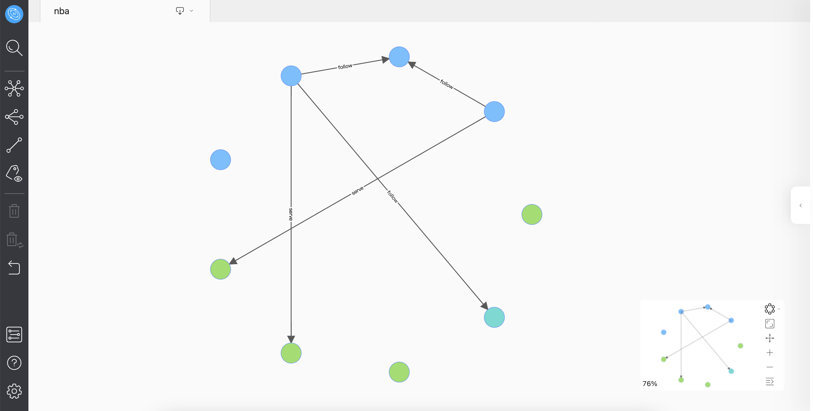

# 页面概览

本文主要介绍 Explorer 的页面，以下给出 Explorer 主页面图：

## 侧边栏

### 开始

单击 （开始）图标，通过VID、Tag和子图，查询数据并显示到页面上。

### 拓展

单击 （拓展）图标，选择页面上的节点并进行自定义拓展，包括拓展方向、拓展步数、过滤条件等。

### 共同邻居

单击 （共同邻居）图标，选择页面上 2 个点并查看它们的共同邻居。

### 路径查询

单击 （路径查询）图标，可以查询起点到终点之间的 `all paths` 、 `Shortest path` 或者是 `Noloop path` 的路径。

### 查看属性

单击 （查看属性）图标，选择是否显示画板中的点或边的属性值。

### 删除

- 删除：单击 （删除）图标，可以删除画板中选中的点。

- 反向删除：单击  （反向删除）图标，可以删除画布中未选择的所有点。

### 撤销

单击 （撤销）图标，撤销上一步操作。

### 图空间选择

单击 （选择图空间）图标，切换当前图空间。

### 帮助

单击 （帮助）图标，查看更多信息。

### 设置

单击 （设置）图标，查看用户名和快捷键、修改语言设置、清除 Explorer 链接。

## 页面

在页面悬窗的缩略图中，用户可以进行对图进行模式切换，设置画布为全屏模式，移动、放大、缩小画布，也可以收起该缩略图。缩略图的左下角显示了画布中的图占总图的比例百分比。

!!! Note

    图的展示模式有 `force` ， `dagre` 和 `circular`三种模式。

## 信息面板

右侧的 图标，用户可以打开菜单，查看画板中 Tag 和 Edge 的数量、搜索 Tag 和 Edge ，并且支持修改 Tag 的颜色和 Icon 。