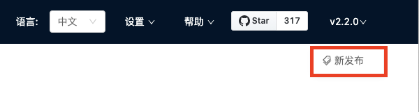

# 版本更新

Studio 处于持续开发状态中。用户可以通过 [Studio 的版本更新记录](https://github.com/vesoft-inc/nebula-web-docker/blob/master/docs/CHANGELOG-zh.md "点击前往 GitHub") 查看最新发布的功能。

## 云服务版 Studio

对于云服务版 Studio，以 Nebula Graph Cloud Service 上实际部署的版本为准，用户不能自行更新 Studio 版本。当前公测环境里的 Studio 版本为 v{{ studio.base111b }}。

## Docker 版和 RPM 版 Studio

对于 Docker 版和 RPM 版 Studio，建议每次都在 `nebula-web-docker` 目录下运行以下命令启动 Studio：

  ```bash
  docker-compose pull && docker-compose up -d
  ```

成功连接 Docker 版 Studio 后，用户可以在页面右上角点击版本号，再点击 **新发布**，前往查看 Studio 的版本更新记录。


