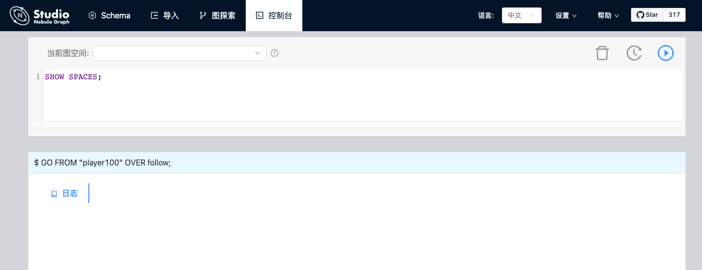

# 连接数据库

在 Nebula Graph Cloud Service 上，创建 Nebula Graph 实例后，您可以一键直连云服务版 Studio。详细信息参考 [Nebula Graph Cloud Service 用户手册](https://cloud-docs.nebula-graph.com.cn/cn/posts/manage-instances/dbaas-ug-connect-nebulastudio/ "点击进入 Nebula Graph Cloud Service 用户手册")。但是，对于 Docker 版和 RPM 版 Studio，在成功启动 Studio 后，您需要配置连接 Nebula Graph。本文主要描述 Docker 版和 RPM 版 Studio 如何连接 Nebula Graph 数据库。

## 前提条件

在连接 Nebula Graph 数据库前，您需要确认以下信息：

- Docker 版或 RPM 版 Studio 已经启动。详细信息参考 [部署 Studio](st-ug-deploy.md)。

- Nebula Graph 的 Graph 服务本机 IP 地址以及服务所用端口。默认端口为 `9669`。

- Nebula Graph 数据库登录账号信息，包括用户名和密码。
  > **说明**：如果 Nebula Graph 已经启用了身份验证，并且已经创建了不同角色的用户，您只能使用被分配到的账号和密码登录数据库。如果未启用身份验证，您可以使用默认用户名（`user`）和默认密码（`password`）登录数据库。关于启用身份验证，参考 [Nebula Graph 用户手册](https://docs.nebula-graph.com.cn/ "点击进入 Nebula Graph 用户手册")。

## 操作步骤

按以下步骤连接 Nebula Graph 数据库：

1. 在 Studio 的 **配置数据库** 页面上，输入以下信息：
   - **Host**：填写 Nebula Graph 的 Graph 服务本机 IP 地址及端口。格式为 `ip:port`。如果端口未修改，则使用默认端口 `9669`。
     > **说明**：即使 Nebula Graph 数据库与 Studio 部署在同一台机器上，您也必须在 **Host** 字段填写这台机器的本机 IP 地址，而不是 `127.0.0.1` 或者 `localhost`。
   - **用户名** 和 **密码**：根据 Nebula Graph 的身份验证设置填写登录账号和密码。
     - 如果未启用身份验证，可以填写默认用户名 `user` 和默认密码 `password`。
     - 如果已启用身份验证，但是未创建账号信息，您只能以 GOD 角色登录，必须填写 `root` 及对应的密码 `nebula`。
     - 如果已启用身份验证，同时又创建了不同的用户并分配了角色，不同角色的用户使用自己的账号和密码登录。

      

2. 完成设置后，点击 **连接** 按钮。  
   如果您能看到如下图所示的界面，表示您已经成功连接到 Nebula Graph 数据库。

    

一次连接会话持续 30 分钟。如果您超过 30 分钟没有操作，会话即断开，您需要重新登录数据库。

## 后续操作

成功连接 Nebula Graph 数据库后，根据账号的权限，您可以选择执行以下操作：

- 如果您以拥有 GOD 或者 ADMIN 权限的账号登录，可以使用 [**控制台**](../quick-start/st-ug-create-schema.md) 或者 [**Schema**](../manage-schema/st-ug-crud-space.md) 页面管理 Schema。
- 如果您以拥有 GOD、ADMIN、DBA 或者 USER 权限的账号登录，可以 [批量导入数据](../quick-start/st-ug-import-data.md) 或者在 **控制台** 页面上运行 nGQL 语句插入数据。
- 如果您以拥有 GOD、ADMIN、DBA、USER 或者 GUEST 权限的账号登录，可以在 **控制台** 页面上运行 nGQL 语句读取数据或者在 **图探索** 页面上进行图探索或数据分析。
