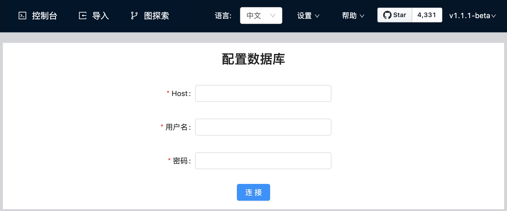

# 部署 Studio

云服务版 Studio 只能在 Nebula Graph Cloud Service 上使用。当您在 Nebula Graph Cloud Service 上创建 Nebula Graph 实例时即自动完成云服务版本 Studio 的部署，一键直连即可使用，不需要自己部署。详细信息参考[《Nebula Graph Cloud Service 用户手册》](https://cloud-docs.nebula-graph.com.cn/cn/posts/manage-instances/dbaas-ug-connect-nebulastudio/ "点击前往 Nebula Graph Cloud Service 用户手册")。但是，您需要自己部署 Docker 版 Studio。本文描述如何部署 Docker 版 Studio。

## 前提条件

在部署 Docker 版 Studio 之前，您需要确认以下信息：

- Nebula Graph 服务已经部署并启动。详细信息，参考[Nebula Graph安装部署](https://docs.nebula-graph.com.cn/2.0.1/4.deployment-and-installation/1.resource-preparations/ "点击前往 Nebula Graph 安装部署")。
  > **说明**：您可以使用Docker Compose或RPM方式部署并启动 Nebula Graph 服务。如果您刚开始使用 Nebula Graph，建议您使用 Docker Compose 部署 Nebula Graph。详细信息参考 [使用 Docker Compose 部署 Nebula Graph](https://github.com/vesoft-inc/nebula-docker-compose/blob/master/README_zh-CN.md "点击前往 GitHub 网站")。

- 在即将运行 Docker 版 Studio 的机器上安装并启动 Docker Compose。详细信息参考 [Docker Compose 文档](https://docs.docker.com/compose/install/ "点击前往 Docker 文档中心")。

- （可选）在中国大陆从 Docker Hub 拉取 Docker 镜像的速度可能比较慢，您可以使用 `registry-mirrors` 参数配置加速镜像。例如，如果您要使用 Docker 中国区官方镜像、网易镜像和中国科技大学的镜像，则按以下格式配置 `registry-mirrors` 参数：

  ```json
  {
  "registry-mirrors": [
    "https://registry.docker-cn.com",
    "http://hub-mirror.c.163.com",
    "https://docker.mirrors.ustc.edu.cn"
    ]
  }
  ```

  配置文件的路径和方法因您的操作系统和/或 Docker Desktop 版本而异。详细信息参考 [Docker Daemon 配置文档](https://docs.docker.com/engine/reference/commandline/dockerd/#daemon-configuration-file "点击前往 Docker 文档中心")。

## 操作步骤

在命令行工具中按以下步骤依次运行命令，部署并启动 Docker 版 Studio：

1. 下载 Studio 的部署配置文件。

    ```bash
    git clone https://github.com/vesoft-inc/nebula-web-docker.git
    ```

2. 切换到 `nebula-web-docker` 目录。

    ```bash
    cd nebula-web-docker
    ```

3. 拉取 Studio 的 Docker 镜像。

    ```bash
    docker-compose pull
    ```

4. 构建并启动 Studio 服务。其中，`-d` 表示在后台运行服务容器。

   ```bash
   docker-compose up -d
   ```

    当屏幕返回以下信息时，表示 Docker 版 Studio 已经成功启动。

    ```bash
    Creating docker_importer_1 ... done
    Creating docker_client_1   ... done
    Creating docker_web_1      ... done
    Creating docker_nginx_1    ... done
    ```

5. 启动成功后，在浏览器地址栏输入 `http://ip address:7001`。
   > **说明**：在运行 Docker 版 Studio 的机器上，您可以运行 `ifconfig` 或者 `ipconfig` 获取本机 IP 地址。如果您使用这台机器访问 Studio，可以在浏览器地址栏里输入 `http://localhost:7001`。

    如果您在浏览器窗口中能看到以下登录界面，表示您已经成功部署并启动 Studio。

    

## 后续操作

进入 Studio 登录界面后，您需要连接 Nebula Graph。详细信息，参考 [连接数据库](st-ug-connect.md)。

## FAQ

Q:studio有rpm安装或者其他非docker部署方式吗？

A:目前支持rpm包安装，详细信息，参考[使用RPM或DEB安装包安装Nebula Graph](https://docs.nebula-graph.com.cn/2.0.1/4.deployment-and-installation/2.compile-and-install-nebula-graph/2.install-nebula-graph-by-rpm-or-deb/)。

Q:前提条件搭建成功，studio启动失败。

A:您可以检查7001，8080，5699的端口是否被占用。如果端口号被占用，可以考虑kill服务或修改studio服务启动端口。

```bash
//检查端口是否被占用
losf -i:7001

//修改studio服务启动端口
$ vi config/config.default.js

//修改
...
    config.cluster = {
        listen: {
            port: 7001, // 修改这个端口号，改成任意一个当前可用的即可
            hostname: '0.0.0.0',
        },
    };
...

//重新启动npm
$ npm run start
```