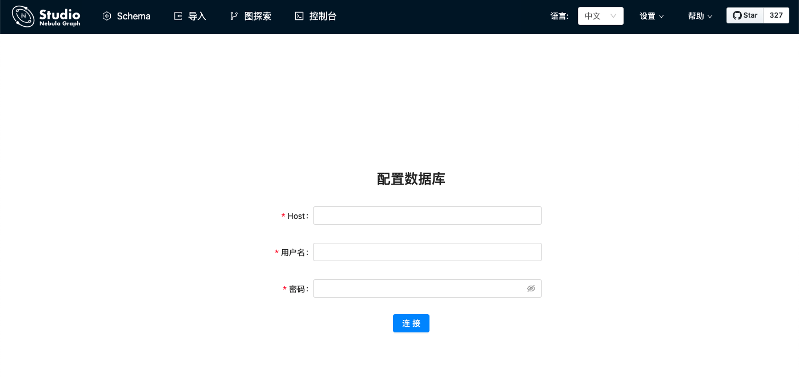

# 部署 Studio

Nebula Graph Studio（ 以下简称 Studio ）支持云端或本地部署。云服务版 Studio 只能在 Nebula Graph Cloud Service 上使用。当在 Nebula Graph Cloud Service 上创建 Nebula Graph 实例时即自动完成云服务版本 Studio 的部署，一键直连即可使用，不需要自己部署。详细信息参考[《Nebula Graph Cloud Service 用户手册》](https://cloud-docs.nebula-graph.com.cn/cn/posts/manage-instances/dbaas-ug-connect-nebulastudio/ "点击前往 Nebula Graph Cloud Service 用户手册")。本文介绍如何在本地通过 Docker 和 RPM 部署 Studio。

## Docker 部署 Studio
### 前提条件

在部署 Docker 版 Studio 之前，用户需要确认以下信息：

- Nebula Graph 服务已经部署并启动。详细信息，参考[Nebula Graph安装部署](../../4.deployment-and-installation/1.resource-preparations.md "点击前往 Nebula Graph 安装部署")。

  !!! Note

        用户可以使用Docker Compose或RPM方式部署并启动 Nebula Graph 服务。如果刚开始使用 Nebula Graph，建议使用 Docker Compose 部署 Nebula Graph。详细信息参考 [使用 Docker Compose 部署 Nebula Graph](../../2.quick-start/2.deploy-nebula-graph-with-docker-compose.md "点击前往 GitHub 网站")。

- 在即将运行 Docker 版 Studio 的机器上安装并启动 Docker Compose。详细信息参考 [Docker Compose 文档](https://docs.docker.com/compose/install/ "点击前往 Docker 文档中心")。
- 确保在安装开始前，以下端口处于未被使用状态。

   | 端口号 | 说明 |
   | ---- | ---- |
   | 7001 | Studio提供的web服务 |
   | 8080 | Nebula-http-gateway，Client的HTTP服务 |
   | 5699 | Nebula importer文件导入工具，数据导入服务 |

- （可选）在中国大陆从 Docker Hub 拉取 Docker 镜像的速度可能比较慢，用户可以使用 `registry-mirrors` 参数配置加速镜像。例如，如果要使用 Docker 中国区官方镜像、网易镜像和中国科技大学的镜像，则按以下格式配置 `registry-mirrors` 参数：

   ```json
   {
   "registry-mirrors": [
     "https://registry.docker-cn.com",
     "http://hub-mirror.c.163.com",
     "https://docker.mirrors.ustc.edu.cn"
     ]
   }
   ```

   配置文件的路径和方法因操作系统和/或 Docker Desktop 版本而异。详细信息参考 [Docker Daemon 配置文档](https://docs.docker.com/engine/reference/commandline/dockerd/#daemon-configuration-file "点击前往 Docker 文档中心")。

### 操作步骤

在命令行工具中按以下步骤依次运行命令，部署并启动 Docker 版 Studio：

1. 下载 Studio 的部署配置文件。

   ```bash
   git clone https://github.com/vesoft-inc/nebula-graph-studio.git
   ```

2. 切换到 `nebula-graph-studio` 目录。

   ```bash
   cd nebula-graph-studio
   ```

3. 拉取 Studio 的 Docker 镜像。

   ```bash
   docker-compose pull
   ```

4. 构建并启动 Studio 服务。其中，`-d` 表示在后台运行服务容器。

   ```bash
   docker-compose up -d
   ```

   当屏幕返回以下信息时，表示 Docker 版 Studio 已经成功启动。

   ```bash
   Creating docker_importer_1 ... done
   Creating docker_client_1   ... done
   Creating docker_web_1      ... done
   Creating docker_nginx_1    ... done
   ```

5. 启动成功后，在浏览器地址栏输入 `http://ip address:7001`。

  !!! Note

        在运行 Docker 版 Studio 的机器上，用户可以运行 `ifconfig` 或者 `ipconfig` 获取本机 IP 地址。如果使用这台机器访问 Studio，可以在浏览器地址栏里输入 `http://localhost:7001`。

   如果在浏览器窗口中能看到以下登录界面，表示已经成功部署并启动 Studio。

   

## RPM 部署Studio

### 前提条件

在部署 RPM 版 Studio 之前，用户需要确认以下信息：

- Nebula Graph 服务已经部署并启动。详细信息，参考[Nebula Graph 安装部署](../../4.deployment-and-installation/1.resource-preparations.md "点击前往 Nebula Graph 安装部署")。
  !!! note

        用户可以使用Docker Compose或RPM方式部署并启动 Nebula Graph 服务。如果刚开始使用 Nebula Graph，建议使用 Docker Compose 部署 Nebula Graph。详细信息参考 [使用 Docker Compose 部署 Nebula Graph](../../2.quick-start/2.deploy-nebula-graph-with-docker-compose.md "点击前往Nebula Graph 安装部署")。

- 使用的 Linux 发行版为 CentOS ，安装有 losf 和版本为 v10.16.0 + 以上的 Node.js。
  
  !!! note "说明"

        `node` 及 `npm` 命令需要安装在 `/usr/bin/`目录下，以防出现 RPM 安装时 node 命令找不到的情况。
        如果依赖安装于用户个人目录下，如 `/usr/local`，用户可以使用以下命令建立软连接：

        ```bash
        $ sudo ln -s /usr/local/bin/node /usr/bin/node
        $ sudo ln -s /usr/local/bin/npm /usr/bin/npm
        ```

- 确保在安装开始前，以下端口处于未被使用状态。
  
  | 端口号 | 说明 |
  | ---- | ---- |
  | 7001 | Studio提供web服务使用。 |
  | 8080 | Nebula HTTP Gateway Client进行HTTP通信使用。 |
  | 5699 | Nebula Importer导入数据导入使用。 |

### 安装

1. 根据需要选择并下载RPM包，建议选择最新版本。常用下载链接如下：

   | 安装包 | 检验和 | Nebula版本 |
   | ----- | ----- | ----- |
   | [nebula-graph-studio-2.2.1-1.x86_64.rpm](https://oss-cdn.nebula-graph.com.cn/nebula-graph-studio/nebula-graph-studio-2.2.1-1.x86_64.rpm) |  [nebula-graph-studio-2.2.1-1.x86_64.rpm.sha256](https://oss-cdn.nebula-graph.com.cn/nebula-graph-studio/nebula-graph-studio-2.2.1-1.x86_64.rpm.sha256) | 2.0.1 |
   | [nebula-graph-studio-2.2.0-1.x86_64.rpm](https://oss-cdn.nebula-graph.com.cn/nebula-graph-studio/nebula-graph-studio-2.2.0-1.x86_64.rpm) |  [nebula-graph-studio-2.2.0-1.x86_64.rpm.sha256](https://oss-cdn.nebula-graph.com.cn/nebula-graph-studio/nebula-graph-studio-2.2.0-1.x86_64.rpm.sha256) | 2.0.1 |
   | [nebula-graph-studio-2.1.9-1.x86_64.rpm](https://oss-cdn.nebula-graph.com.cn/nebula-graph-studio/nebula-graph-studio-2.1.9-1.x86_64.rpm) | - |  2.0 GA |
   | [nebula-graph-studio-1.2.7-2.x86_64.rpm](https://oss-cdn.nebula-graph.com.cn/nebula-graph-studio/nebula-graph-studio-1.2.7-2.x86_64.rpm) | [nebula-graph-studio-1.2.7-2.x86_64.rpm.sha256](https://oss-cdn.nebula-graph.com.cn/nebula-graph-studio/nebula-graph-studio-1.2.7-2.x86_64.rpm.sha256) |  1.x |

2. 使用`sudo rpm -i <rpm>`命令安装RPM包。

   例如，安装Studio {{ studio.base220 }} 版本需要运行以下命令：

   ```bash
   $ sudo rpm -i nebula-graph-studio-2.2.0-1.x86_64.rpm
   ```

### 卸载

用户可以使用以下的命令卸载 Studio。

```bash
$ sudo rpm -e nebula-graph-studio-2.2.0-1.x86_64.rpm
```

### 异常处理

如果在安装过程中自动启动失败或是需要手动启动或停止服务，请使用以下命令

- 手动启动服务
```bash
$ bash /usr/local/nebula-graph-studio/scripts/start.sh
```

- 手动停止服务
```bash  
$ bash /usr/local/nebula-graph-studio/scripts/stop.sh
```

如果启动服务时遇到报错报错 ERROR: bind EADDRINUSE 0.0.0.0:7001，用户可以通过以下命令查看端口7001是否被占用。
```bash
$ losf -i:7001
```

如果端口被占用，且无法结束该端口上进程，用户可以通过以下命令修改Studio服务启动端口，并重新启动服务。
```bash
//修改studio服务启动端口
 $ vi config/config.default.js

 //修改
 ...
     config.cluster = {
         listen: {
             port: 7001, // 修改这个端口号，改成任意一个当前可用的即可
             hostname: '0.0.0.0',
         },
     };
 ...

 //重新启动npm
 $ npm run start
```

## 后续操作

进入 Studio 登录界面后，用户需要连接 Nebula Graph。详细信息，参考[连接数据库](st-ug-connect.md)。
