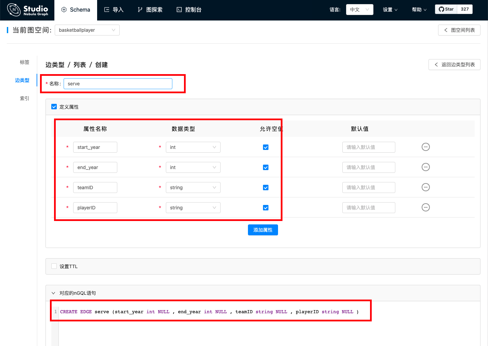

# 操作边类型

在 Nebula Graph 数据库中创建图空间后，用户可能需要创建边类型。用户可以选择使用 **控制台** 或者 **Schema** 操作边类型。本文仅说明如何使用 **Schema** 操作边类型。

## 支持版本

Studio v{{ studio.base220 }} 及以后版本。请更新版本，详细操作参考 [版本更新](../about-studio/st-ug-check-updates.md)。

## 前提条件

在 Studio 上操作边类型之前，用户必须确认以下信息：

- Studio 已经连接到 Nebula Graph 数据库。

- 图空间已经创建。

- 当前登录的账号拥有 GOD、ADMIN 或者 DBA 的权限。

## 创建边类型

按以下步骤使用 **Schema** 创建边类型：

1. 在工具栏中，点击 **Schema** 页签。

2. 在 **图空间列表** 中，找到图空间，点击图空间名称或者在 **操作** 列中点击  图标。

3. 在 **当前图空间** 里确认图空间名称。用户也可以通过选择图空间名称切换图空间。

4. 点击 **边类型** 页签，并点击 **创建** 按钮。

5. 在 **创建** 页面上，完成以下设置：

  1. **名称**：按提示信息输入合规的边类型名称。本示例中，输入 `serve`。

  2. （可选）如果边类型需要属性，在 **定义属性**面板的左上角，点击勾选框，并在展开的列表中，完成以下操作：  
    - 输入属性名称、数据类型和默认值。
    - 如果一个边类型有多个属性，可以点击 **添加属性** 按钮，并定义属性。
    - 如果要删除某个属性，在该属性所在行，点击  图标。

  3. （可选）边类型未设置索引时，用户可以设置 TTL：在 **设置TTL**面板的左上角，点击勾选框，并在展开的列表中设置 `TTL_COL` 和 `TTL_DURATION` 参数信息。关于这两个参数的详细信息，参考 [TTL 配置](../../3.ngql-guide/8.clauses-and-options/ttl-options.md "点击前往 Nebula Graph 网站")。

6. 完成设置后，在 **对应的nGQL语句** 面板上，用户能看到与上述配置等价的 nGQL 语句。  

7. 确认无误后，点击 **+ 创建** 按钮。
  如果边类型创建成功，**定义属性**面板会显示这个边类型的属性列表。

## 修改边类型

按以下步骤使用 **Schema** 修改边类型：

1. 在工具栏中，点击 **Schema** 页签。

2. 在 **图空间列表** 中，找到图空间，点击图空间名称或者在 **操作** 列中点击  图标。

3. 在 **当前图空间** 里确认图空间名称。用户也可以通过选择图空间名称完成图空间切换。

4. 点击 **边类型** 页签，找到需要修改的边类型，并在 **操作** 列中，点击  图标。

5. 在 **编辑** 页面，用户可以选择以下操作：

  - 如果要修改属性：在 **定义属性** 面板上，找到需要修改的属性，在右侧点击 **编辑**，再修改属性的数据类型或者默认值。修改完成后，点击 **确认** 或 **取消**。
  - 如果要删除属性：在 **定义属性** 面板上，找到需要删除的属性，在右侧点击 **删除**，经确认后，删除属性。
  - 如果要添加属性：在 **定义属性** 面板上，点击 **添加属性** 按钮，添加属性信息。
  - 如果要修改 TTL：在 **设置TTL** 面板上，修改或 `TTL_COL` 和 `TTL_DURATION` 设置。
  - 如果要删除所有已经配置的 TTL：在 **设置TTL** 面板的左上角，点击勾选框，取消选择。
  - 如果要设置 TTL：在 **设置TTL** 面板的左上角，点击勾选框，开始设置 TTL。

6. 完成设置后，在 **对应的nGQL语句** 面板上，用户能看到修改后的 nGQL 语句。

## 删除边类型

!!! danger
    删除标签前先确认[影响](../../3.ngql-guide/10.tag-statements/2.drop-tag.md，已删除的数据如未[备份](../../7.data-security/3.manage-snapshot.md)无法恢复。

按以下步骤使用 **Schema** 删除边类型：

1. 在工具栏中，点击 **Schema** 页签。

2. 在 **图空间列表** 中，找到图空间，点击图空间名称或者在 **操作** 列中点击  图标。

3. 在 **当前图空间** 里确认图空间名称。用户也可以通过选择图空间名称切换图空间。

4. 点击 **边类型** 页签，找到需要修改的边类型，并在 **操作** 列中，点击  图标。

5. 在弹出的对话框中点击 **确认**。

## 后续操作

边类型创建成功后，用户可以在 **控制台** 上逐条插入边数据，或者使用 **导入** 功能批量插入边数据。
