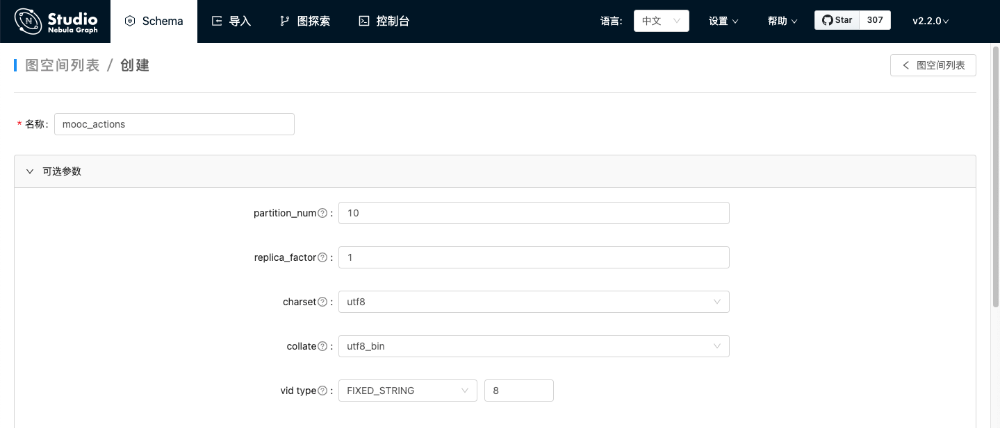
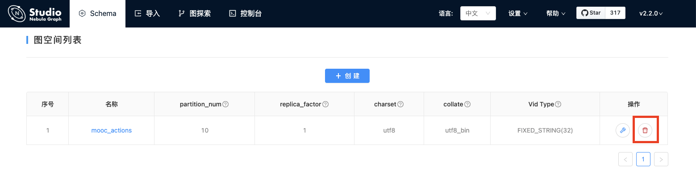

# 操作图空间

Studio 连接到 Nebula Graph 数据库后，用户可以创建或删除图空间。用户可以使用 **控制台** 或者 **Schema** 操作图空间。本文仅说明如何使用 **Schema** 操作图空间。

## 支持版本

Studio v{{ studio.base220 }} 及以后版本。请更新版本，详细操作参考 [版本更新](../about-studio/st-ug-check-updates.md)。

## 前提条件

操作图空间之前，用户需要确保以下信息：

- Studio 已经连接到 Nebula Graph 数据库。
- 当前登录的账号拥有创建或删除图空间的权限，即：
  - 如果 Nebula Graph 未开启身份验证，用户以默认用户名 `user` 账号和默认密码 `password` 登录。
  - 如果 Nebula Graph 已开启身份验证，用户以 `root` 账号及其密码登录。

## 创建图空间

按以下步骤使用 **Schema** 创建图空间：

1. 在工具栏里，点击 **Schema** 页签。

2. 在图空间列表上方，点击 **+ 创建** 按钮。

3. 在 **创建** 页面，完成以下配置：

  1. **名称**：指定图空间名称，本示例中设置为 `basketballplayer`。不可与已有的图空间名称重复。不可使用关键字或保留关键字做标识符，参考[关键字](../../3.ngql-guide/1.nGQL-overview/keywords-and-reserved-words.md "点击前往 关键字")。

  2. **选填参数**：分别设置 `partition_num`、`replica_factor`、`charset`、`collate` 和 `vid type` 的值。在本示例中，四个参数分别设置为 `10`、`1`、`utf8`、`utf8_bin` 和 `FIXED_STRING(32)`。详细信息，参考 [`CREATE SPACE` 语法](../../3.ngql-guide/9.space-statements/1.create-space.md "点击前往 CREATE SPACE")。

  在 **对应的nGQL语句** 面板上，用户能看到上述设置对应的 nGQL 语句。如下所示：

  ```ngql
  CREATE SPACE basketballplayer (partition_num = 10, replica_factor = 1, charset = utf8, collate = utf8_bin, vid_type = FIXED_STRING(32))
  ```

4. 配置确认无误后，点击 **创建** 按钮。
  如果页面回到 **图空间列表**，而且列表中显示刚创建的图空间信息，表示图空间创建成功。



## 删除图空间

!!! danger
    删除图空间会删除其中的所有数据，已删除的数据如未[备份](../../7.data-security/3.manage-snapshot.md)无法恢复。

按以下步骤使用 **Schema** 删除图空间：

1. 在工具栏里，点击 **Schema** 页签。

2. 在图空间列表里，找到需要删除的图空间，并在 **操作** 列中，点击  图标。

  

3. 在弹出的对话框中点击 **确认**。
  删除成功后，页面回到 **图空间列表**。

## 后续操作

图空间创建成功后，用户可以开始创建或修改 Schema，包括：

- [操作Tag](st-ug-crud-tag.md)
- [操作Edge type](st-ug-crud-edge-type.md)
- [操作索引](st-ug-crud-index.md)
