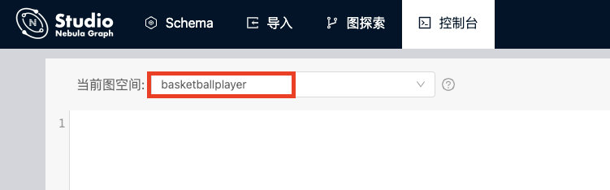

# 创建 Schema

在 Nebula Graph 中，您必须先有 Schema，再向其中写入点数据和边数据。本文描述如何使用 Nebula Graph 的 **控制台** 或 **Schema** 功能创建 Schema。

> **说明**：您也可以使用 nebula-console 创建 Schema。详细信息，参考 [使用 Docker Compose 部署 Nebula Graph
](https://github.com/vesoft-inc/nebula-docker-compose/blob/master/README_zh-CN.md) 和 [Nebula Graph 快速开始](https://docs.nebula-graph.com.cn/2.0.1/2.quick-start/1.quick-start-workflow/)。

## 前提条件

在 Studio 上创建 Schema 之前，您需要确认以下信息：

- Studio 已经连接到 Nebula Graph 数据库。

- 您的账号拥有 GOD、ADMIN 或 DBA 权限。详细信息，参考 [Nebula Graph 内置角色](https://docs.nebula-graph.com.cn/2.0.1/7.data-security/1.authentication/3.role-list/)。

- 您已经规划好了 Schema 的要素。

- 已经创建了图空间。
  > **说明**：本示例假设已经创建了图空间。如果您的账号拥有 GOD 权限，也可以在 **控制台** 或 **Schema** 上创建一个图空间。

## 使用 Schema 管理功能创建 Schema

按以下步骤使用 **Schema** 创建 Schema：

1. 创建标签。详细信息，参考 [操作标签](../manage-schema/st-ug-crud-tag.md)。

2. 创建边类型。详细信息，参考 [操作边类型](../manage-schema/st-ug-crud-edge-type.md)。

## 使用控制台创建 Schema

按以下步骤使用 **控制台** 创建 Schema：

1. 在工具栏里，点击 **控制台** 页签。

2. 在 **当前Space** 中选择一个图空间。在本示例中，选择 **basketballplayer**。

   

3. 在命令行中，依次输入以下语句，并点击  图标。

   ```nGQL
   -- 创建标签 player，带有 2 个属性
   CREATE TAG player(name string, age int);

   -- 创建标签 team，带有 1 个属性
   CREATE TAG team(name string);

   -- 创建边类型 follow，带有 1 个属性
   CREATE EDGE follow(degree int);

   -- 创建边类型 serve，带有 2 个属性
   CREATE EDGE serve(start_year int, end_year int);
   ```

至此，您已经完成了 Schema 创建。您可以运行以下语句查看标签与边类型的定义是否正确、完整。

```nGQL
-- 列出当前图空间中所有标签
SHOW TAGS;

-- 列出当前图空间中所有边类型
SHOW EDGES;

-- 查看每种标签和边类型的结构是否正确
DESCRIBE TAG player;
DESCRIBE TAG team;
DESCRIBE EDGE follow;
DESCRIBE EDGE serve;
```

## 后续操作

创建 Schema 后，您可以开始 [导入数据](st-ug-import-data.md)。
