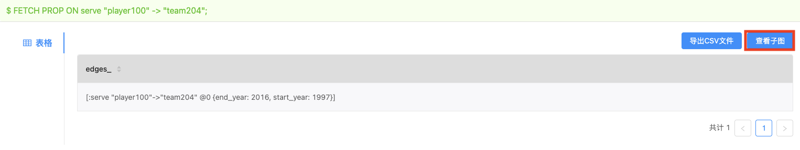
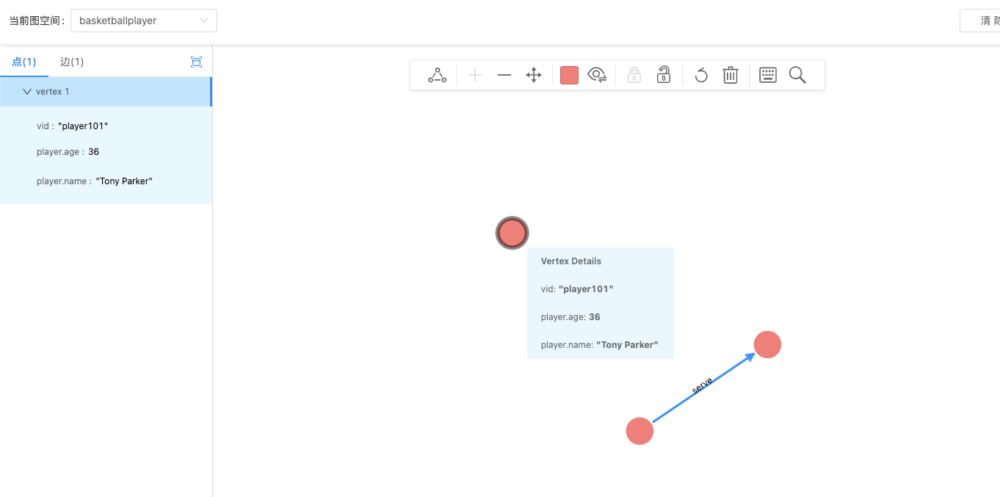

# 查询图数据

导入数据后，用户可以开始使用 **控制台** 或者 **图探索** 查询图数据。

以查询代表球员"player100"与球队"team204"的边的属性为例：

* 在 **控制台** 页面：运行 `FETCH PROP ON serve "player100" -> "team204";`，数据库会返回 rank 为0的边。返回结果后，点击 **查看子图** 按钮，将点数据查询结果导入 **图探索** 进行可视化显示。  

* 在 **图探索** 页面：点击 **开始探索** 按钮，在 **指定VID** 对话框中，输入 **"player101"**，**图探索** 画板里会显示这个点，将鼠标移到点上，用户能看到这个点所有属性信息，如下图所示。  

