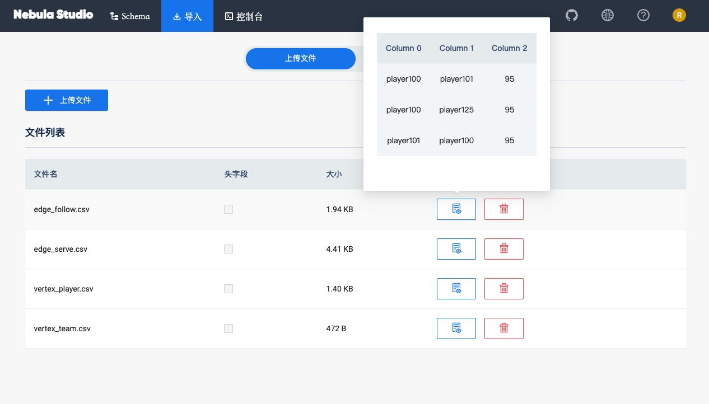

# 导入数据

准备好 CSV 文件，创建了 Schema 后，用户可以使用 **导入** 功能将所有点和边数据上传到 Studio，用于数据查询和数据分析。

## 前提条件

导入数据之前，需要确认以下信息：

- Studio 已经连接到 Nebula Graph 数据库。

- Nebula Graph 数据库里已经创建了 Schema。

- CSV 文件符合 Schema 要求。

- 账号拥有 GOD、ADMIN、DBA 或者 USER 的权限，能往图空间中写入数据。

## 操作步骤

### 上传文件

按照以下步骤倒入数据：

1. 在顶部导航栏里，点击 **导入** 页签。
2. 在 **上传文件** 页面，点击 **上传文件** 按钮，并选择需要的 CSV 文件。本示例中，选择 `edge_serve.csv`、`edge_follow.csv`、`vertex_player.csv` 和 `vertex_team.csv` 文件。

  !!! Note

        一次可以选择多个 CSV 文件，本文使用的 CSV 文件可以在[规划 Schema ](st-ug-plan-schema.md) 中下载。

3. 上传结束后，可以在文件列表的 **操作** 列，点击  图标预览文件内容，或点击  图标删除上传的文件。

### 导入数据

按照以下步骤倒入数据：

1. 在顶部导航栏里，点击 **导入** 页签。
2. 在标签页内点击 **导入数据** 按钮。
3. 在 **导入数据** 页面，点击 **+ 创建导入任务** 按钮.

## 后续操作

完成数据导入后，用户可以开始[图探索](st-ug-explore.md)。
