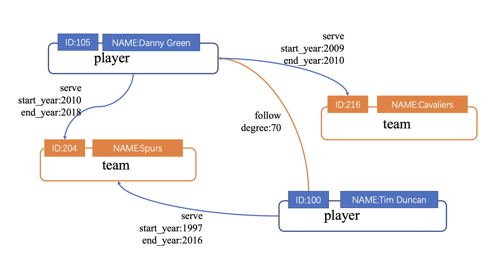

# 规划 Schema

在使用 Studio 之前，用户需要先根据 Nebula Graph 数据库的要求规划 Schema（模式）。

 Schema 至少要包含以下要素：

* Tag，以及每种Tag的属性。

* Edge type，以及每种Edge type的属性。

用户可以下载Nebula Graph示例数据集[basketballplayer](https://docs-cdn.nebula-graph.com.cn/dataset/dataset.zip "点击下载") ，本文将通过该实例说明如何规划 Schema。

下表列出了 Schema 要素。

| 类型 | 名称 | 属性名（数据类型） | 说明 |
| :--- | :--- | :---| :--- |
| Tag |  **player**  | - `name` （`string`）  - `age` （`int`）  | 表示球员。  |
| Tag |   **team** | - `name` （`string`） |  表示球队。 |
| Edge type |  **serve**  | - `start_year` （`int`）   - `end_year` （`int`） | 表示球员的行为。 该行为将球员和球队联系起来，方向是从球员到球队。  |
| Edge type |  **follow**  | - `degree`（`int`）  | 表示球员的行为。 该行为将两个球员联系起来，方向是从一个球员到另一个球员。  |

下图说明示例中 **player** 类点与 **team** 类点之间如何发生关系（**serve**/**follow**）。

