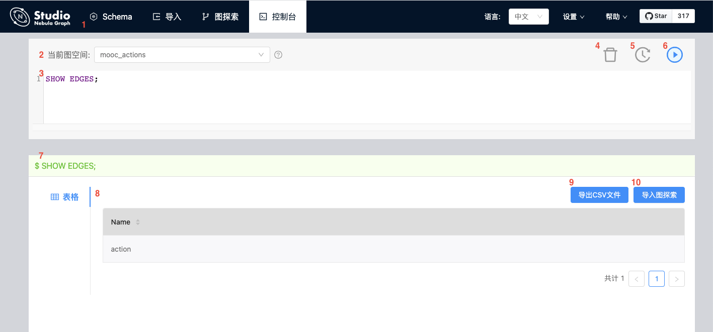

# 控制台界面

Studio 的控制台界面如下图所示。

下表列出了控制台界面上的各种功能。

| 编号  |  功能 | 说明  |
| :-- | :--|   :--   |
| 1   |  工具栏   |  点击 **控制台** 页签进入控制台页面。 |
|  2  |  选择图空间  | 在 **当前图空间** 列表中选择一个图空间。   **说明**：Studio 不支持直接在输入框中运行 `USE <space_name>` 语句。  |
|  3  |  输入框   |  在输入框中输入 nGQL 语句后，点击  按钮运行语句。您可以同时输入多个语句同时运行，语句之间以 `;` 分隔。
|  4  |  清空输入框  | 点击  按钮，清空输入框中已经输入的内容。   |
|  5  |  重复语句输入   |  点击  按钮，在语句运行记录列表里，点击其中一个语句，输入框中即自动输入该语句。列表里提供最近 15 次语句运行记录。  |
|  6  |  运行  |  在输入框中输入 nGQL 语句后，点击  按钮即开始运行语句。   |
|  7  |  语句运行状态   |  运行 nGQL 语句后，这里显示语句运行状态。如果语句运行成功，语句以绿色显示。如果语句运行失败，语句以红色显示。   |
|  8  |  结果窗口 |  显示语句运行结果。如果语句会返回结果，结果窗口会以表格形式呈现返回的结果。 |
|  9  |  导出CSV文件 |  运行 nGQL 语句返回结果后，点击 **导出CSV文件** 按钮即能将结果以 CSV 文件的形式导出。   |
|  10 |  图探索功能键   |  根据您运行的 nGQL 语句，您可以点击图探索功能键将返回的结果导入 **图探索** 进行可视化展现，例如 [导入图探索](st-ug-open-in-explorer.md) 和 [查看子图](st-ug-visualize-findpath.md)。  |
