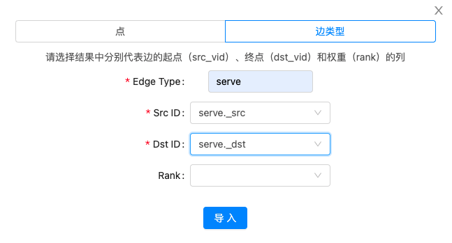
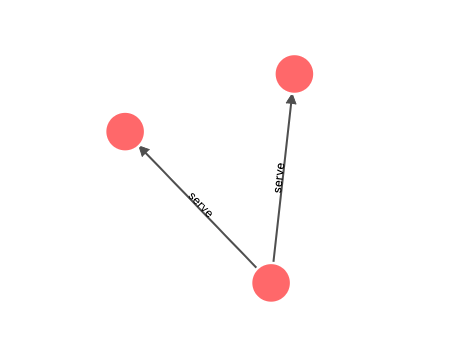
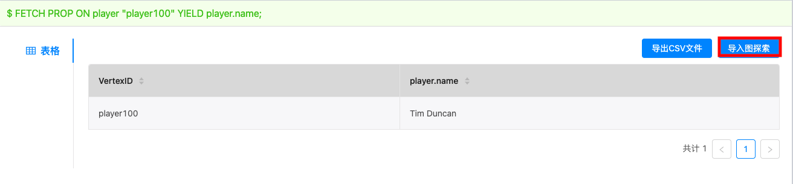

# 导入图探索

用户可以在 **控制台** 上使用 nGQL 语句查询得到点或边的信息，再借助 **导入图探索** 功能实现查询结果的可视化。

## 支持版本

Studio v{{ studio.base220 }} 及以后版本。请更新版本，详细操作参考 [版本更新](../about-studio/st-ug-check-updates.md)。

## 前提条件

使用导入图探索前，用户需要确认以下信息：

- Studio 已经连接到 Nebula Graph 数据库。详细信息参考 [连接数据库](../deploy-connect/st-ug-connect.md)。
- 已经导入数据集。详细操作参考 [导入数据](../quick-start/st-ug-import-data.md)。

## 导入边数据

按以下步骤将 **控制台** 查询得到的边数据结果导入 **图探索**：

1. 在工具栏里，点击 **控制台** 页签。

2. 在 **当前Space** 中选择一个图空间。在本示例中，选择 **basketballplayer**。

3. 在命令行中，输入查询语句，并点击  图标。

  !!! Note

        查询结果中必须包括边起点和终点 VID 信息。

  查询语句示例如下：

  ```nGQL
  nebula> GO FROM "player102" OVER serve YIELD serve._src,serve._dst;
  ```

  查询结果可以看到 `playerId` 为 `palyer102` 的球员服务球队的起始年份及终止年份。如下图所示。

  

4. 点击 **导入图探索** 按钮。

5. 在弹出对话框中，完成如下配置：

  1. 点击 **边类型**。

  2. 在 **Edge Type** 字段，填写边类型名称。在本示例中，填写 `serve`。

  3. 在 **Src ID** 字段，选择查询结果中代表边起点 VID 的列名。在本示例中，选择 `serve._src`。

  4. 在 **Dst ID** 字段，选择查询结果中代表边终点 VID 的列名。在本示例中，选择 `serve._dst`。

  5. （可选）如果返回的边数据中有边权重（`rank`）信息，则在 **Rank** 字段，选择代表边权重的列名。如果 **Rank** 字段未设置，默认为 0。

  6. 完成配置后，点击 **导入** 按钮。

  

6. 如果 **图探索** 页面此前已有数据，在弹出的窗口中选择数据插入方式：

  - **增量插入**：在画图板原来的数据基础上插入新的数据。
  - **清除插入**：清除画图板上原来的数据后，再插入新的数据。

数据插入成功后可以看到其可视化表现。



## 导入点数据结果

按以下步骤将 **控制台** 查询得到的点数据结果导入 **图探索**：

1. 在工具栏里，点击 **控制台** 页签。

2. 在 **当前Space** 中选择一个图空间。在本示例中，选择 **basketballplayer**。

3. 在命令行中，输入查询语句，并点击  图标。

  !!! Note

        查询结果中必须包括点的 VID 信息。

  查询语句示例如下：

  ```nGQL
  nebula> FETCH PROP ON player "player100" YIELD player.name;
  ```

  查询得到 `playerId` 为 `player100` 的球员信息。如下图所示。

  

4. 点击 **导入图探索** 按钮。

5. 在弹出对话框中，配置如下：
  1. 点击 **点**。  

  2. 在 **Vertex ID** 字段，选择查询结果中代表点 VID 的列名。在本示例中，选择 `VertexID`。  

  3. 完成配置后，点击 **导入** 按钮。  

  

6. 如果 **图探索** 页面此前已有数据，在弹出的窗口中选择数据插入方式：

  - **增量插入**：在画图板原来的数据基础上插入新的数据。

  - **清除插入**：清除画图板上原来的数据后，再插入新的数据。

数据插入成功后，用户可以看到查询得到的点数据的可视化表现。

## 后续操作

数据导入图探索后，用户可以对数据进行拓展分析。
