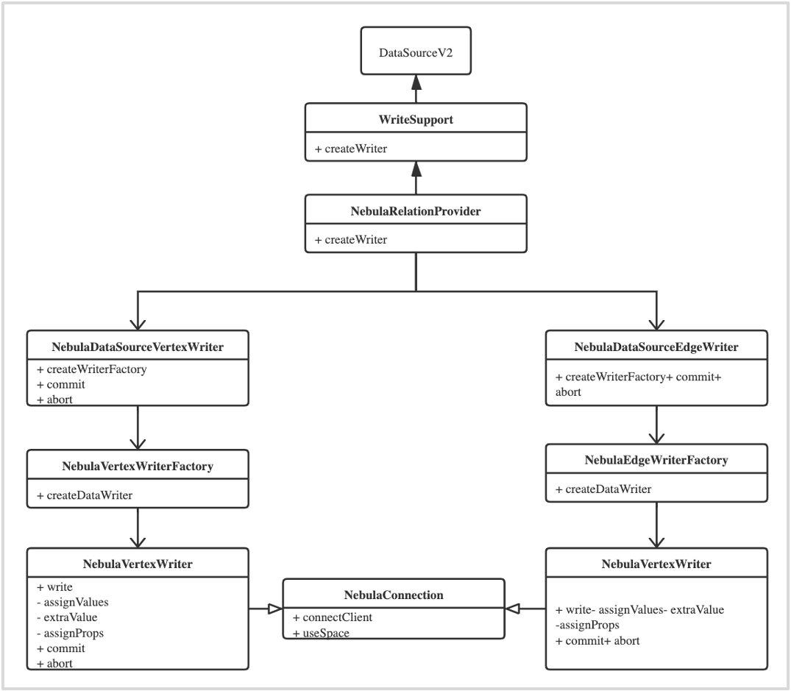

# 什么是 Nebula Spark Connector Writer

Nebula Spark Connector Writer 是 Nebula Spark Connector 的组成部分，为您提供了 Spark SQL 接口，您可以使用 Spark SQL 接口编程将 DataFrame 数据逐条或批量写入 Nebula Graph。

## Nebula Spark Connector Writer 实现原理

Nebula Spark Connector Writer 分别提供了两个接口，用于逐条或批量地将数据写入 Nebula Graph。

## 逐条写入数据

Nebula Spark Connector Writer 基于 Spark 的 `DataSourceV2` 接口实现单条数据写入，实现步骤如下：

1. 继承 `WriteSupport` 接口并重写 `createWriter` 方法，并使用这个方法创建自定义的 `DataSourceWriter` 接口。
2. 继承 `DataSourceWriter` 接口，创建 `NebulaDataSourceVertexWriter` 类和 `NebulaDataSourceEdgeWriter` 类。重写 `createWriterFactory` 方法并返回自定义的 `DataWriterFactory`。重写 `commit` 方法，用于提交整个事务。重写 `abort` 方法，用于做事务回滚。
   > **说明**：Nebula Graph v1.1.0 不支持事务操作，所以，在这个实现中，`commit` 和 `abort` 无实质性操作。
3. 继承 `DataWriterFactory`，创建 `NebulaVertexWriterFactory` 类和 `NebulaEdgeWriterFactory` 类，重写 `createWriter` 方法返回自定义的 `DataWriter`。
4. 继承 `DataWriter`，创建 `NebulaVertexWriter` 类和 `NebulaEdgeWriter` 类。重写 `write` 方法，用于写出数据。重写 `commit` 方法，用于提交事务。重写 `abort` 方法，用于做事务回滚。
   > **说明**：Nebula Graph v1.1.0 不支持事务操作，所以在 `DataWriter` 中，`commit` 和 `abort` 无实质性操作。

Nebula Spark Connector Writer 的实现类图如下：

`NebulaVertexWriter` 和 `NebulaEdgeWriter的write` 方法中定义了具体写入逻辑。逐条写入数据的逻辑概括如下：

1. 创建客户端，连接 Nebula Graph 的 Graph 服务。
2. 指定即将写入数据的 Nebula Graph 图空间。
3. 构造 Nebula Graph 插入数据的 nGQL 语句。
4. 提交 nGQL 语句，执行写入操作。
5. 定义回调函数接收写入操作执行结果。

### 批量数据写入

Nebula Spark Connector Writer 批量写入数据的实现与 [Nebula Exchange](../../nebula-exchange/about-exchange/ex-ug-what-is-exchange.md) 类似，即通过对 DataFrame 进行 `map` 操作批量数据的累计提交。

## 应用示例

参考 [Nebula Spark Connector Writer 应用示例](sc-ug-writer-example.md)。
