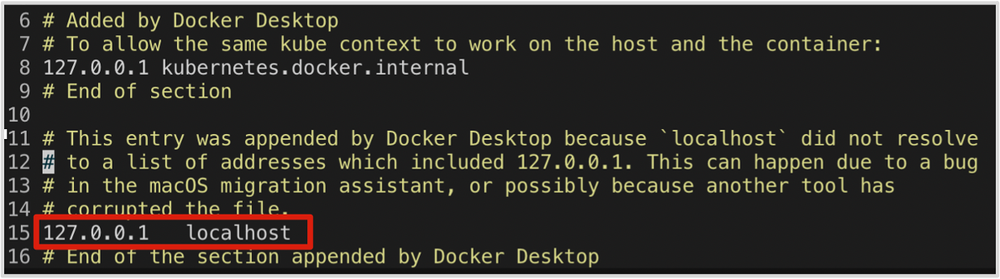

# 无法访问 Studio  

## 问题描述

我按照文档描述启动 Studio 后访问 `127.0.0.1:7001` 或者 `0.0.0.0:7001`，但是打不开页面，为什么？

## 可能的原因及解决方法

- Studio 与浏览器是否在同一台机器上？  
  
  如果 Studio 与浏览器在同一台机器上，在浏览器里使用 `127.0.0.1:7001` 或者 `0.0.0.0:7001` 访问 Studio。如果两者不在同一台机器上，则在浏览器里输入 `<Studio 机器 IP:7001>`。

- 部署 Studio 的机器是否为 x86-64 架构？
  
  目前 Studio 仅支持 x86-64 系统架构。

- 服务是否已经正常启动？
  
  在命令行工具里，运行 `docker-compose ps` 查看服务是否正常。  
  如果服务正常，返回结果如下：

  ```bash
                Name                          Command               State               Ports
  ------------------------------------------------------------------------------------------------------
  nebula-web-docker_client_1     ./nebula-go-api                  Up      0.0.0.0:32782->8080/tcp
  nebula-web-docker_importer_1   nebula-importer --port=569 ...   Up      0.0.0.0:32783->5699/tcp
  nebula-web-docker_nginx_1      /docker-entrypoint.sh ngin ...   Up      0.0.0.0:7001->7001/tcp, 80/tcp
  nebula-web-docker_web_1        docker-entrypoint.sh npm r ...   Up      0.0.0.0:32784->7001/tcp
  ```

- `127.0.0.1:7001` 是否能正常访问？

  按以下步骤排查：

  1. 在部署 Studio 的机器上使用 Docker 启动其他任意一个 Web Server 服务，确认是否能通过 `127.0.0.1` 访问该服务。如果不能访问，说明是当前机器的网络访问问题，与 Studio 无关。如果能访问，再进行下一步操作。
  
  2. 按 [部署 Studio](../deploy-connect/st-ug-deploy.md) 的描述启动 Studio 服务后，在命令行工具里，运行 `docker-compose exec -it nebula-web-docker_web_1` 进入 `nebula-web-docker_web_1` 容器内部，运行 `curl 127.0.0.1:7001` 查看连接是否正常。

  3. 如果连接不正常，您可以在 `nebula-web-docker_web_1` 容器的 `/etc/host` 文件中添加一行：`127.0.0.1 localhost`，如下图所示。

  

## 相关文档

- [部署 Studio](../deploy-connect/st-ug-deploy.md)

- [连接 Studio](../deploy-connect/st-ug-connect.md)
